# Aylens — AI Agent 统一互联网检索网关架构方案

> 状态：Target Architecture / Roadmap
> 技术栈：Node.js + TypeScript  
> 文档性质：本文描述长期目标、设计原则和演进方向，**不是当前实现清单**。当前行为以 `README.md`、`docs/` 运行文档和代码为准。
> 目标：为 AI Agent 提供统一、可扩展、可配置、可审计，并支持跨主机 Provider / Browser Runtime 的互联网检索与内容读取能力。
>
> **已落地执行边界**：Gateway 只做控制与调度，所有抓取必须经 Runner；Gateway 进程不加载执行型 Provider，
> 也不持有 Transport / Browser Profile / 登录态。该决策的正式记录见
> [docs/adr/2026-09-28-gateway-control-plane-only.md](./docs/adr/2026-09-28-gateway-control-plane-only.md)。

---

## 当前实现快照

截至当前代码，已经实现：

- Fastify REST Gateway、API Key 鉴权与 Admin UI；
- Gateway 纯控制面，Provider 只在远程 Runner 执行；
- Runner WebSocket 注册、心跳、`EXECUTE` / `CANCEL`、容量与 capability 上报；
- Provider Plugin / `.aylens-provider` 加载；
- Direct / HTTP Proxy / SOCKS5 Transport；
- persistent Chrome、CDP attach、Browser Profile Lease、Runner 默认共享 Profile；
- `POST /v1/search`、Provider/Runtime/Audit 查询接口；
- 内存 Audit；
- MCP `search` / `list_runtimes` tool adapter definitions（没有独立 MCP Server）。

当前**尚未实现**，本文后续章节出现时都应理解为目标设计：

- `ReadService` / 独立 Read API；
- Query Planner；
- Cache、Normalize / Dedupe / Rank / Diversity pipeline；
- PostgreSQL、Redis、Object Storage；
- OpenTelemetry / Prometheus 等完整可观测设施；
- 完整 MCP SDK Server / wire transport；
- Google、Brave、X、知乎、小红书等真实渠道 Provider；
- 通用 Provider 重试 / fallback / circuit breaker / proxy pool；
- 完整 NetworkPolicy 与私网 SSRF 防护。当前 `generic-browser` 只限制 HTTP/HTTPS，并拒绝 URL 内嵌用户名密码。

本文中的 V1/V2/V3 分期是规划参考，部分能力已经提前实现、部分仍未实现；判断当前状态时不要按章节分期推断。

---

## 1. 项目定位

Aylens 是一个面向 AI Agent 的统一互联网检索网关（Retrieval Gateway）。

它不是“某几个网站的爬虫集合”，也不把业务逻辑绑定到 Google、X、知乎、小红书等具体平台。长期目标是通过统一协议向上层 Agent 提供：

- 多来源统一搜索；
- URL 内容读取与正文抽取；
- Provider 按配置启停；
- 每个 Provider 独立配置直连、HTTP Proxy、SOCKS5、Proxy Pool；
- Provider 运行在 Windows/Linux Runner 上，由 Gateway 统一调度；
- 支持真实 Google Chrome、持久 Browser Profile 和本机登录态复用；
- Runner 可分布在不同网络和电脑，通过统一调度接入；
- Provider 级超时、限流、并发、重试和 fallback；
- 路由策略；
- 搜索结果统一归一化；
- 去重、排序和来源多样性控制；
- 缓存；
- 完整 provenance；
- 请求与上游调用审计；
- REST API；
- MCP Server；
- 可观测性与错误追踪。

Aylens 的长期形态应接近一个“自托管的 Agent Retrieval Infrastructure”，而不是一个特定站点适配器项目。

---

## 2. 设计目标

### 2.1 核心目标

1. **统一**
   - Agent 不需要理解每个平台不同的 API。
   - 所有 Provider 输出统一的 `SearchDocument`。
   - Search、Read、Audit 对 Agent 提供稳定协议。

2. **可扩展**
   - 增加新数据源时，不修改 SearchService 核心流程。
   - 同一个平台允许存在多个 Provider 实现。
   - Provider 与 Transport 解耦。

3. **配置驱动**
   - Provider 是否启用由配置决定。
   - Provider 使用什么代理由配置决定。
   - 路由、fallback、并发和重试策略尽量配置化。

4. **可审计**
   - 每个 Search/Read 请求都有 request_id / trace_id。
   - 能追溯 Agent 最终使用了哪些来源。
   - 能追溯每个 Provider 当时返回了什么。
   - 敏感凭据不得进入审计数据。

5. **Agent Native**
   - 优先考虑“搜索 → 筛选 → 阅读 → 回答”的 Agent 使用模式。
   - REST 与 MCP 共用同一套 Core Service。

6. **安全**
   - 默认防止 SSRF。
   - 默认不允许 Transport fallback 绕过 network policy。
   - 密钥与代理账号不出现在日志和审计中。

### 2.2 非目标

V1 不追求：

- 一次接入所有网站；
- 自建搜索引擎索引；
- 大规模分布式爬虫；
- 绕过平台认证或访问控制；
- 把所有站点特殊字段强行压缩进一个最小模型；
- 第一版就引入复杂 LLM rerank。

---

## 3. 核心设计原则

Aylens 最重要的边界：

```text
Provider 负责：访问谁、如何理解该平台、如何映射结果。

Runtime / Runner 负责：Provider 在哪里执行，并承载机器本地能力。

Browser Runtime 负责：Chrome、Browser Profile、登录态、页面生命周期和 Profile Lease。

Transport 负责：当前 Runtime 上的请求如何出网。

Router 负责：这次请求应该访问哪些 Provider。

Execution Dispatcher 负责：把 Provider Operation 调度到兼容 Runtime。

SearchService 负责：编排、合并、去重、排序和返回。

Audit 负责：记录发生过什么。

Cache 负责：避免重复成本。

API / MCP 负责：协议适配，不承载业务逻辑。
```

因此：

> Provider ≠ Machine  
> Provider ≠ Network  
> Provider ≠ Proxy  
> Provider ≠ Browser Profile  
> Provider ≠ Routing  
> Provider ≠ Retry Policy  
> Provider ≠ Audit  
> Provider ≠ Cache

同时必须坚持两个新的分布式原则：

1. **Provider 是可调度执行单元，只在 Runner 上运行，从不作为 Gateway 进程内的 class 执行。**
2. **登录态、代理密钥、Chrome User Data 等有状态资源优先留在执行节点本地，Gateway 只持有逻辑引用。**

---

## 4. 目标总体架构

Aylens 采用 **Control Plane + Distributed Execution Plane + Browser Plane**。Gateway 只负责控制与调度，每个 Provider Operation 都下发到已连接的 Linux/Windows Runner 执行；Gateway 自身不访问目标网站。

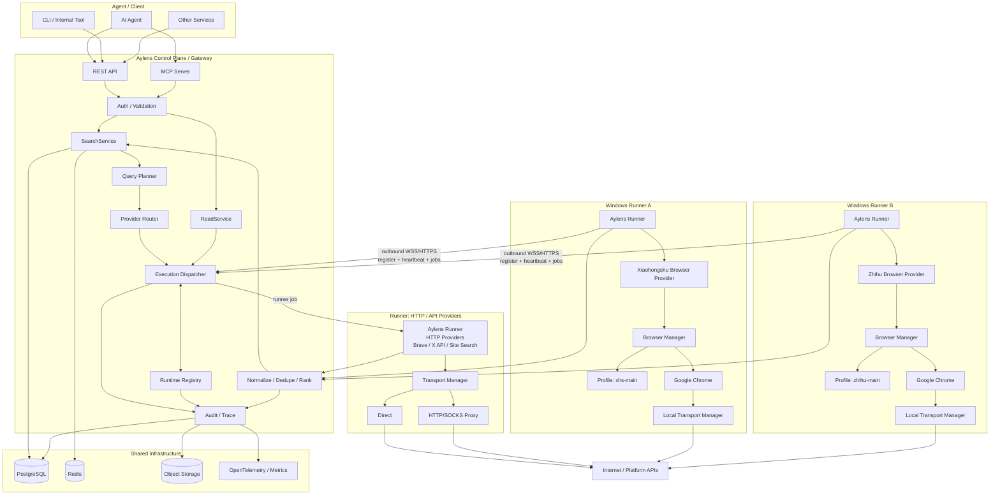
```mermaid
flowchart TB
    subgraph Client["Agent / Client"]
        A1["AI Agent"]
        A2["CLI / Internal Tool"]
        A3["Other Services"]
    end

    subgraph Control["Aylens Control Plane / Gateway"]
        REST["REST API"]
        MCP["MCP Server"]
        AUTH["Auth / Validation"]
        SS["SearchService"]
        RS["ReadService"]
        PLANNER["Query Planner"]
        ROUTER["Provider Router"]
        DISPATCH["Execution Dispatcher"]
        RREG["Runtime Registry"]
        NORMALIZE["Normalize / Dedupe / Rank"]
        AUDIT["Audit / Trace"]
    end

    subgraph HttpRunner["Runner: HTTP / API Providers"]
        LP["Aylens Runner<br/>HTTP Providers<br/>Brave / X API / Site Search"]
        LTM["Transport Manager"]
        LD["Direct"]
        LPROXY["HTTP/SOCKS Proxy"]
    end

    subgraph WindowsA["Windows Runner A"]
        RA["Aylens Runner"]
        XHSP["Xiaohongshu Browser Provider"]
        BMA["Browser Manager"]
        PROFA["Profile: xhs-main"]
        CHA["Google Chrome"]
        TMA["Local Transport Manager"]
    end

    subgraph WindowsB["Windows Runner B"]
        RB["Aylens Runner"]
        ZHP["Zhihu Browser Provider"]
        BMB["Browser Manager"]
        PROFB["Profile: zhihu-main"]
        CHB["Google Chrome"]
        TMB["Local Transport Manager"]
    end

    subgraph Infra["Shared Infrastructure"]
        PG[("PostgreSQL")]
        REDIS[("Redis")]
        OBJ[("Object Storage")]
        OTEL["OpenTelemetry / Metrics"]
    end

    INTERNET["Internet / Platform APIs"]

    A1 --> REST
    A1 --> MCP
    A2 --> REST
    A3 --> REST
    REST --> AUTH
    MCP --> AUTH

    AUTH --> SS
    AUTH --> RS
    SS --> PLANNER --> ROUTER --> DISPATCH
    RS --> DISPATCH

    DISPATCH <--> RREG

    DISPATCH -->|"runner job"| LP
    LP --> LTM
    LTM --> LD --> INTERNET
    LTM --> LPROXY --> INTERNET

    RA -->|"outbound WSS/HTTPS<br/>register + heartbeat + jobs"| DISPATCH
    RB -->|"outbound WSS/HTTPS<br/>register + heartbeat + jobs"| DISPATCH

    RA --> XHSP --> BMA
    BMA --> PROFA
    BMA --> CHA
    CHA --> TMA --> INTERNET

    RB --> ZHP --> BMB
    BMB --> PROFB
    BMB --> CHB
    CHB --> TMB --> INTERNET

    LP --> NORMALIZE
    RA --> NORMALIZE
    RB --> NORMALIZE
    NORMALIZE --> SS

    SS --> PG
    SS --> REDIS
    DISPATCH --> AUDIT
    RREG --> AUDIT
    NORMALIZE --> AUDIT
    AUDIT --> PG
    AUDIT --> OBJ
    AUDIT --> OTEL
```

核心变化是：Gateway 从不执行 Provider，也不接触目标网站。Provider 的执行位置由 Dispatcher 在已连接的 Runner 中选出；登录态、代理和浏览器等机器本地资源由对应 Runner 独占管理。

---

## 5. 一次搜索请求的完整流程

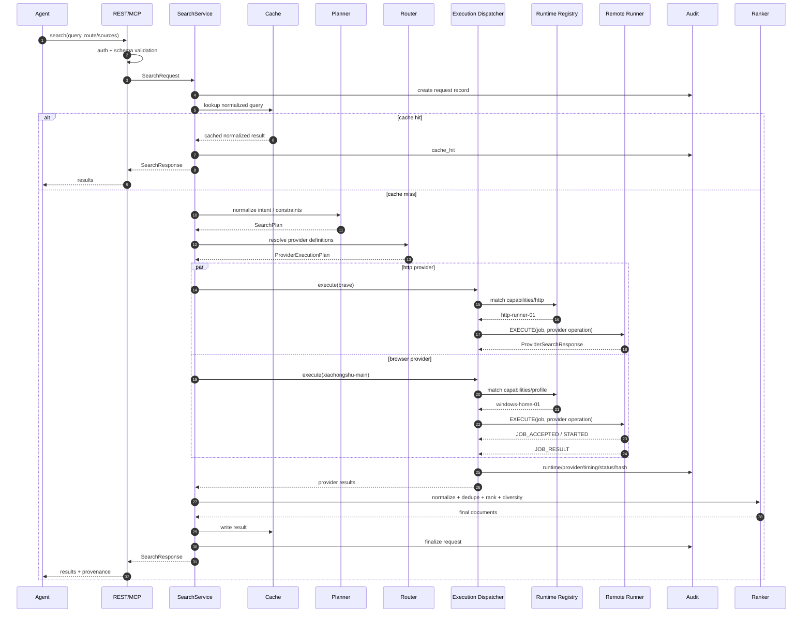
```mermaid
sequenceDiagram
    autonumber

    participant Agent
    participant API as REST/MCP
    participant Search as SearchService
    participant Cache
    participant Planner
    participant Router
    participant Dispatch as Execution Dispatcher
    participant Registry as Runtime Registry
    participant Runner as Remote Runner
    participant Audit
    participant Ranker

    Agent->>API: search(query, route/sources)
    API->>API: auth + schema validation
    API->>Search: SearchRequest

    Search->>Audit: create request record
    Search->>Cache: lookup normalized query

    alt cache hit
        Cache-->>Search: cached normalized result
        Search->>Audit: cache_hit
        Search-->>API: SearchResponse
        API-->>Agent: results
    else cache miss
        Search->>Planner: normalize intent / constraints
        Planner-->>Search: SearchPlan

        Search->>Router: resolve provider definitions
        Router-->>Search: ProviderExecutionPlan

        par http provider
            Search->>Dispatch: execute(brave)
            Dispatch->>Registry: match capabilities/http
            Registry-->>Dispatch: http-runner-01
            Dispatch->>Runner: EXECUTE(job, provider operation)
            Runner-->>Dispatch: ProviderSearchResponse
        and browser provider
            Search->>Dispatch: execute(xiaohongshu-main)
            Dispatch->>Registry: match capabilities/profile
            Registry-->>Dispatch: windows-home-01
            Dispatch->>Runner: EXECUTE(job, provider operation)
            Runner-->>Dispatch: JOB_ACCEPTED / STARTED
            Runner-->>Dispatch: JOB_RESULT
        end

        Dispatch->>Audit: runtime/provider/timing/status/hash
        Dispatch-->>Search: provider results

        Search->>Ranker: normalize + dedupe + rank + diversity
        Ranker-->>Search: final documents

        Search->>Cache: write result
        Search->>Audit: finalize request
        Search-->>API: SearchResponse
        API-->>Agent: results + provenance
    end
```

---

## 6. Search 和 Read 必须拆分

Agent 的典型链路：


```mermaid
flowchart LR
    Q["用户问题"] --> S["search"]
    S --> C["候选结果 20 条"]
    C --> A["Agent 判断相关性"]
    A -->|Top 3~5 URLs| R["batchRead"]
    R --> M["Clean Markdown"]
    M --> L["LLM Reasoning"]
    L --> O["带引用的答案"]
```

搜索阶段只返回足够判断相关性的内容，不应该默认下载所有全文。

好处：

- Context 更小；
- 网络请求更少；
- 避免大量无效抓取；
- Agent 可以根据结果动态决定读取哪些网页；
- Search 与正文解析能够独立演进。

建议 V1 对外接口：

```text
POST /v1/search
POST /v1/read
POST /v1/batch-read
GET  /v1/requests/:requestId
GET  /health
GET  /ready
```

MCP Tools：

```text
search
search_web
search_x
search_site
read_url
batch_read
get_retrieval_audit
```

REST 和 MCP 必须调用同一个 Core Service。

---

## 7. 分层职责

### 7.1 Interface Layer

职责：

- API Key 校验；
- MCP 协议；
- REST/OpenAPI；
- 参数 schema 校验；
- request_id 注入；
- 错误码转换。

不负责：

- Provider 路由；
- 排序；
- Proxy；
- Provider retry。

### 7.2 Application/Core Layer

核心组件：

- `SearchService`
- `ReadService`
- `QueryPlanner`
- `ProviderRouter`
- `ExecutionDispatcher`
- `RuntimeRegistry`
- `RuntimeSelector`
- `BrowserProfileManager`
- `ResultNormalizer`
- `Deduplicator`
- `Ranker`
- `AuditService`

### 7.3 Provider Layer

Provider 是平台适配器。

例如：

- Brave Search；
- X 官方 API；
- Google-compatible Search API；
- Site Search；
- 独立知乎适配器；
- 独立小红书适配器；
- Generic Web Reader。

Provider 不允许自行读取全局代理环境并私自决定网络出口。

同一套 Provider contract 在所有 Runner 上复用。Gateway 保存的是 Provider Definition 和 runtime requirements，不加载也不实例化任何执行型 Provider；实际 Provider class 由 Runner 的 Provider Registry 创建。

### 7.4 Execution Runtime Layer

统一负责：

- Runner 的调度与选择；
- Runtime capability registry；
- Provider-to-Runtime 调度；
- Runner session 与 heartbeat；
- remote job lifecycle；
- capacity reservation；
- Browser Profile affinity 与 lease；
- Runner disconnect/reconnect reconciliation。

Execution Runtime 不负责理解知乎、小红书、X 等平台语义。


### 7.5 Transport Layer

统一负责：

- direct；
- HTTP proxy；
- HTTPS proxy；
- SOCKS5；
- proxy pool；
- timeout；
- connection reuse；
- proxy health；
- network policy；
- 出网错误标准化。

### 7.6 Infrastructure Layer

- PostgreSQL：结构化请求、审计、结果元数据；
- Redis：缓存、限流、锁、provider health；
- Object Storage：raw JSON、HTML、压缩 payload；
- OpenTelemetry：trace；
- Prometheus：metrics。

---

## 8. Provider 抽象

建议核心接口：

```ts
export interface SearchProvider {
  readonly id: string;

  capabilities(): ProviderCapabilities;

  search(
    context: SearchContext,
    request: SearchRequest
  ): Promise<ProviderSearchResponse>;

  read?(
    context: ReadContext,
    request: ReadRequest
  ): Promise<ProviderDocument>;

  healthCheck?(): Promise<ProviderHealth>;
}
```

Capabilities：

```ts
export interface ProviderCapabilities {
  search: boolean;
  read: boolean;

  supportsDateRange: boolean;
  supportsLanguage: boolean;
  supportsAuthorFilter: boolean;
  supportsDomainFilter: boolean;

  maxResults: number;

  retrievalMethod:
    | "official_api"
    | "search_api"
    | "site_search"
    | "http_fetch"
    | "browser"
    | "third_party";
}
```

Provider 结果仍然允许保留平台原生字段：

```ts
export interface ProviderSearchResponse {
  provider: string;
  items: SearchDocument[];
  nextCursor?: string;

  upstream: {
    requestId?: string;
    status: number;
    latencyMs: number;
  };
}
```

---

## 9. Provider Registry + Factory

Provider 名称和实现类型必须分离。

配置：

```yaml
providers:
  x-official:
    type: x-api
    runtime:
      selector:
        capabilities:
          http: true

  x-web:
    type: site-search
    runtime:
      selector:
        capabilities:
          http: true
```

此时：

- `x-official` 是 Provider 实例 ID；
- `x-api` 是 Provider implementation type。

Registry 分成两层：

- **Gateway 侧**只保存 Provider Definition（实例 ID、type、enabled、runtime requirements 与非敏感调度配置）；
- **Runner 侧**的 Provider Registry 持有 `ProviderFactory`，并真正 `create()` 出 Provider 实例。

```ts
export interface ProviderFactory<TConfig = unknown> {
  readonly type: string;

  create(
    config: TConfig,
    context: ProviderContext
  ): SearchProvider;
}
```

Gateway 启动流程：

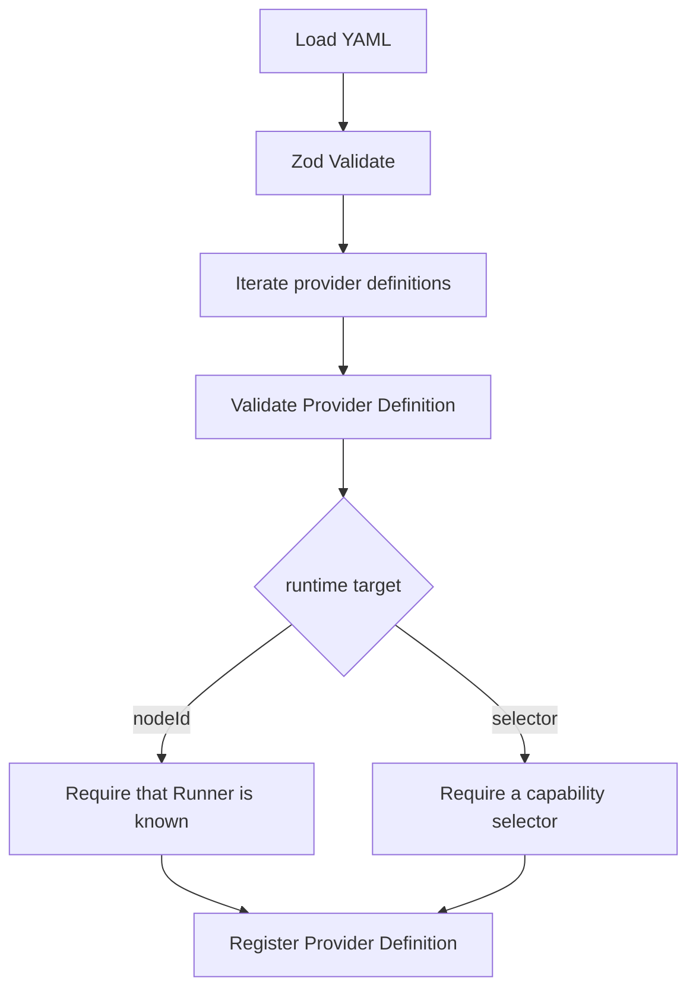
```mermaid
flowchart TD
    CFG["Load YAML"] --> VALID["Zod Validate"]
    VALID --> PLOOP["Iterate provider definitions"]
    PLOOP --> DEF["Validate Provider Definition"]

    DEF --> TARGET{"runtime target"}
    TARGET -->|"nodeId"| PIN["Require that Runner is known"]
    TARGET -->|"selector"| SEL["Require a capability selector"]

    PIN --> READY["Register Provider Definition"]
    SEL --> READY
```

Gateway 从不构造 Provider 实例，也不调用 `ProviderFactory.create()`；它只保存 Provider Definition、operation schema 和 runtime requirements。真正的 Factory / Provider 实现由 Runner 加载和执行。

`runtime` 是必填字段，不存在隐式的“在 Gateway 本地执行”默认值；没有可用 Runner 时请求返回 `NO_COMPATIBLE_RUNTIME`，不做回退。

增加新 Provider 的最理想流程：

1. 新建目录；
2. 实现 Factory + SearchProvider；
3. 注册 provider type；
4. YAML 增加实例配置；
5. 不修改 SearchService。

---

## 10. Transport 抽象

建议所有普通 HTTP Provider 都通过统一 Transport。

```ts
export interface HttpTransport {
  request<T>(
    context: TransportContext,
    request: HttpRequest
  ): Promise<HttpResponse<T>>;
}
```

实现：

```text
DirectTransport
HttpProxyTransport
Socks5Transport
ProxyPoolTransport
```

浏览器能力**不属于 HttpTransport 的一种实现**。真实 Chrome 有 Cookie、LocalStorage、IndexedDB、User Data Directory、窗口/Tab、扩展、登录 Session、账号风控等状态，因此应独立为 Browser Runtime：

```text
HTTP Provider
  -> HttpTransport
  -> Direct / HTTP Proxy / SOCKS5 / Proxy Pool

Browser Provider
  -> BrowserManager
  -> BrowserProfile Lease
  -> Chrome / Chromium
  -> Runtime-local Network / Proxy
```

两条路径可以共享 NetworkPolicy、ProxyProfile 和观测模型，但不能把 Browser API 强行压缩成普通 HTTP request/response 语义。

---

## 11. Provider 与 Transport 解耦

本节描述的是**单个 Runner 内部**的 Provider/Transport 关系。Provider 只看到所在 Runner 注入的 Transport，而不会直接访问其它 Runner 的代理配置。

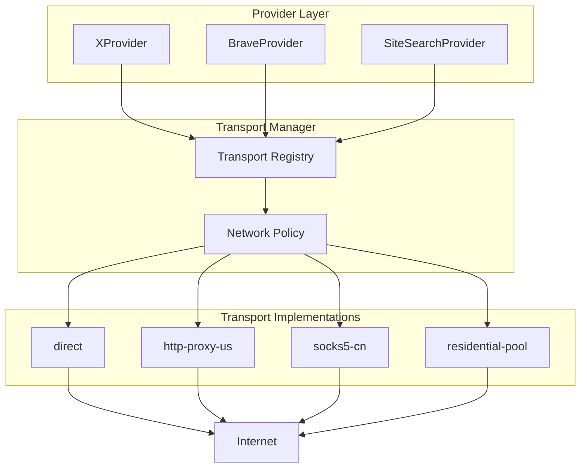
```mermaid
flowchart TB
    subgraph ProviderLayer["Provider Layer"]
        PX["XProvider"]
        PB["BraveProvider"]
        PS["SiteSearchProvider"]
    end

    subgraph TransportManager["Transport Manager"]
        REG["Transport Registry"]
        POLICY["Network Policy"]
    end

    subgraph TransportImplementations["Transport Implementations"]
        D["direct"]
        HP["http-proxy-us"]
        SK["socks5-cn"]
        PP["residential-pool"]
    end

    PX --> REG
    PB --> REG
    PS --> REG

    REG --> POLICY
    POLICY --> D
    POLICY --> HP
    POLICY --> SK
    POLICY --> PP

    D --> NET["Internet"]
    HP --> NET
    SK --> NET
    PP --> NET
```

Provider 只做：

```ts
const response = await this.transport.request(ctx, {
  method: "GET",
  url,
  headers,
  query
});
```

它不应该知道：

- proxy URL；
- proxy username/password；
- SOCKS protocol；
- proxy pool；
- direct fallback。

在分布式模式中这条边界仍成立，只是 TransportManager 位于**实际执行 Provider 的 Runtime**。远程 Provider 引用的 `transport: proxy-cn` 是 Runner 本地逻辑名称，而不是要求 Gateway 拥有该代理。

---

## 12. Transport 配置设计

建议配置：

```yaml
transports:
  direct:
    type: direct

  proxy-us:
    type: http-proxy
    url: "${PROXY_US_URL}"

    timeout:
      connectMs: 5000
      requestMs: 15000

  proxy-cn:
    type: socks5
    url: "${PROXY_CN_URL}"

    timeout:
      connectMs: 5000
      requestMs: 20000

  residential-us:
    type: proxy-pool

    strategy: round-robin

    endpoints:
      - "${PROXY_RESIDENTIAL_US_01}"
      - "${PROXY_RESIDENTIAL_US_02}"
      - "${PROXY_RESIDENTIAL_US_03}"

    health:
      enabled: true
      failureThreshold: 3
      cooldownSeconds: 60
```

Secret 只通过环境变量或 Secret Manager 注入，不直接提交到配置文件。

每个 Runner 拥有自己的 Transport Registry。Gateway 配置中不存在 transport 段，也不解析任何代理凭据；transport 完全由 Runner 本地配置与本地 Secret 解析。

---

## 13. Network Policy

Transport fallback 必须受到 Network Policy 约束。

例如：

```yaml
networkPolicies:
  default:
    allowDirect: true
    allowProxy: true

  proxy-only:
    allowDirect: false
    allowProxy: true

  direct-only:
    allowDirect: true
    allowProxy: false
```

Provider：

```yaml
providers:
  x-official:
    type: x-api
    networkPolicy: proxy-only

  brave:
    type: brave
    networkPolicy: direct-only
```

这是重要的 fail-closed 设计。

如果 `x-official` 要求 `proxy-only`，代理失效后不能为了“高可用”偷偷 direct。

---

## 14. 多 Transport 与故障切换

Provider 可配置 transport chain：

```yaml
providers:
  x-official:
    type: x-api

    networkPolicy: proxy-only

    transport:
      primary: proxy-us
      fallback:
        - proxy-us-backup
```

不允许：

```yaml
fallback:
  - direct
```

除非 NetworkPolicy 明确允许 direct。

故障流程：

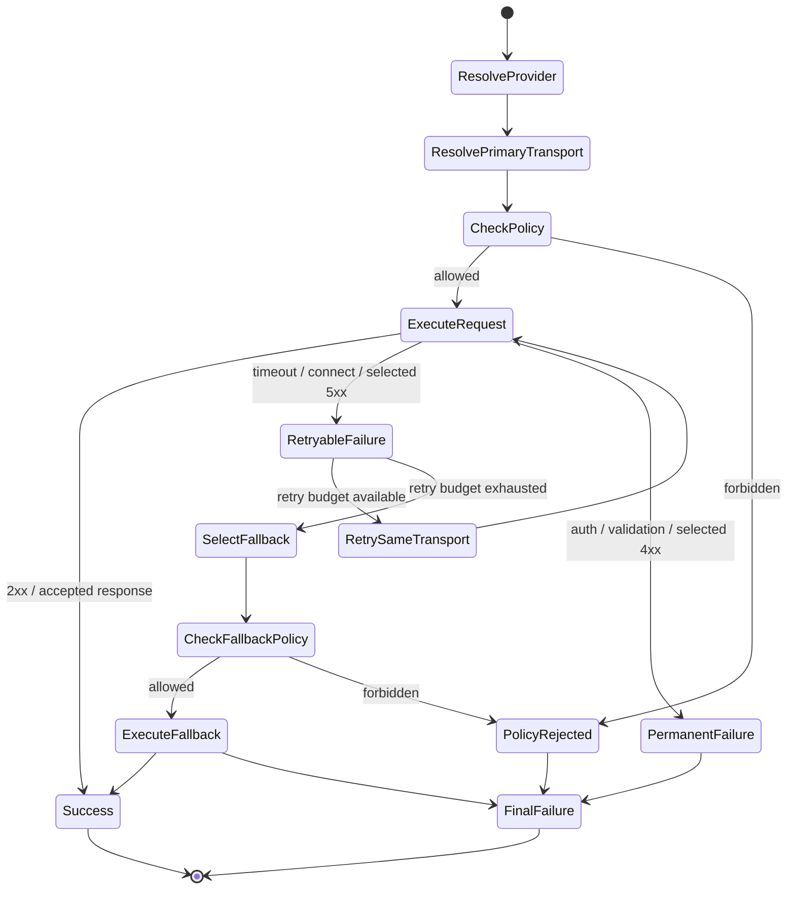
```mermaid
stateDiagram-v2
    [*] --> ResolveProvider
    ResolveProvider --> ResolvePrimaryTransport

    ResolvePrimaryTransport --> CheckPolicy
    CheckPolicy --> ExecuteRequest: allowed
    CheckPolicy --> PolicyRejected: forbidden

    ExecuteRequest --> Success: 2xx / accepted response
    ExecuteRequest --> RetryableFailure: timeout / connect / selected 5xx
    ExecuteRequest --> PermanentFailure: auth / validation / selected 4xx

    RetryableFailure --> RetrySameTransport: retry budget available
    RetrySameTransport --> ExecuteRequest

    RetryableFailure --> SelectFallback: retry budget exhausted
    SelectFallback --> CheckFallbackPolicy

    CheckFallbackPolicy --> ExecuteFallback: allowed
    CheckFallbackPolicy --> PolicyRejected: forbidden

    ExecuteFallback --> Success
    ExecuteFallback --> FinalFailure

    PermanentFailure --> FinalFailure
    PolicyRejected --> FinalFailure
    Success --> [*]
    FinalFailure --> [*]
```

---

## 15. 重试策略

重试不建议由 Provider 各自实现。

统一 Executor / Transport Policy：

```yaml
retryPolicies:
  api-default:
    attempts: 2
    backoff: exponential
    baseDelayMs: 200
    maxDelayMs: 2000
    retryOn:
      - network_error
      - timeout
      - 429
      - 502
      - 503
      - 504
```

对于非幂等请求，默认不自动重试。

搜索请求通常为 GET，可安全配置有限重试。

注意避免双层重试：

```text
Provider retry × Transport retry
```

否则 2 × 3 很容易放大为 6 次调用。

建议只有一个层级拥有“业务级重试预算”。

---

## 16. Route 设计

Route 是 Agent 与 Provider 列表之间的抽象。

```yaml
routes:
  default:
    providers:
      - brave

  realtime:
    providers:
      - x-official
      - brave

  chinese-social:
    providers:
      - zhihu-web
      - xiaohongshu-web
      - brave

  developer:
    providers:
      - github-web
      - stackoverflow-web
      - brave
```

Agent：

```json
{
  "query": "OpenAI 最近发布了什么",
  "route": "realtime"
}
```

无需知道具体 Provider 名称。

---

## 17. Route 与显式 Sources 的优先级

建议规则：

1. 如果传 `sources`，使用显式 sources；
2. 如果没有 sources、传了 route，解析 route；
3. 两者都没有，使用 `default` route；
4. 可选 `auto` 交给 Planner 根据 query 分类。

例如：

```json
{
  "query": "Claude Code",
  "sources": ["x-official", "zhihu-web"]
}
```

用于 Agent 需要精确控制来源的情况。

---

## 18. Query Planner

V1 Planner 不必使用 LLM。

规则即可：

```text
query
 + language
 + freshness
 + requested sources
 + route
 + domain filters
 + result limit
        ↓
SearchPlan
```

未来可以增加：

- 语言检测；
- 新闻/实时意图；
- 中文社交平台意图；
- 技术社区意图；
- query expansion；
- 多语种 query rewrite。

---

## 19. Provider 并发执行

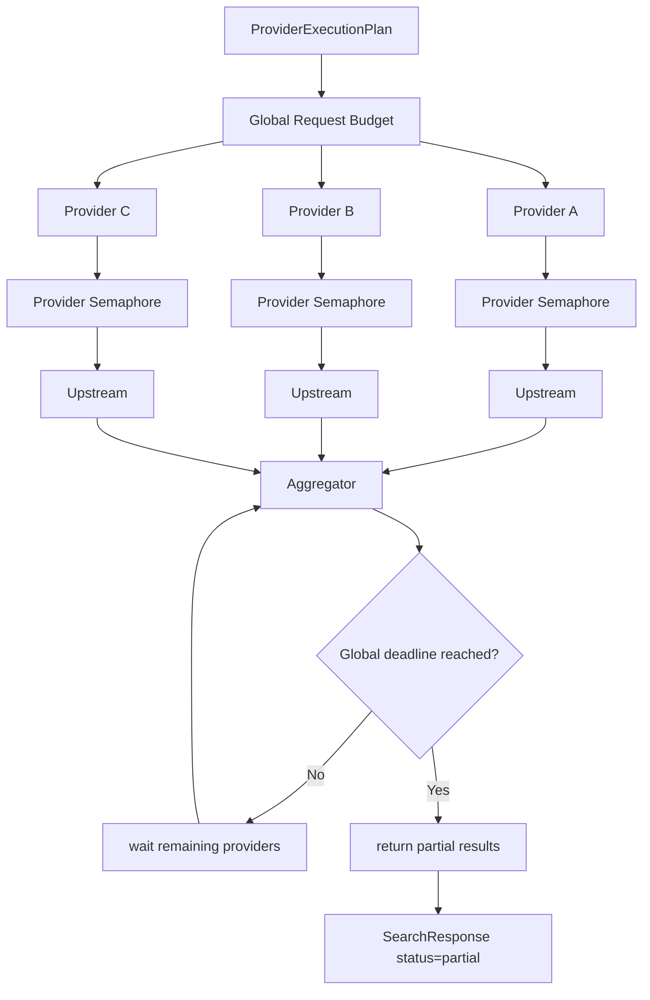
```mermaid
flowchart TD
    PLAN["ProviderExecutionPlan"] --> BUDGET["Global Request Budget"]

    BUDGET --> P1["Provider A"]
    BUDGET --> P2["Provider B"]
    BUDGET --> P3["Provider C"]

    P1 --> L1["Provider Semaphore"]
    P2 --> L2["Provider Semaphore"]
    P3 --> L3["Provider Semaphore"]

    L1 --> U1["Upstream"]
    L2 --> U2["Upstream"]
    L3 --> U3["Upstream"]

    U1 --> AGG["Aggregator"]
    U2 --> AGG
    U3 --> AGG

    AGG --> DEADLINE{"Global deadline reached?"}
    DEADLINE -->|No| WAIT["wait remaining providers"]
    DEADLINE -->|Yes| PARTIAL["return partial results"]

    WAIT --> AGG
    PARTIAL --> FINAL["SearchResponse status=partial"]
```

建议搜索采用“允许部分成功”：

- Brave 成功；
- X 超时；
- Zhihu 成功；

最终仍然返回结果：

```json
{
  "status": "partial"
}
```

并在 `meta.providers` 中说明 X 超时。

---

## 20. 统一数据模型

核心对象：

```ts
export interface SearchDocument {
  id: string;

  platform:
    | "web"
    | "x"
    | "zhihu"
    | "xiaohongshu"
    | string;

  type:
    | "webpage"
    | "post"
    | "answer"
    | "article"
    | "note"
    | "video"
    | string;

  url: string;
  canonicalUrl?: string;

  title?: string;
  text?: string;
  snippet?: string;

  author?: {
    id?: string;
    name?: string;
    handle?: string;
    url?: string;
  };

  publishedAt?: string;
  updatedAt?: string;
  retrievedAt: string;

  media?: Array<{
    type: "image" | "video" | "audio";
    url?: string;
  }>;

  metrics?: {
    likes?: number;
    comments?: number;
    shares?: number;
    views?: number;
  };

  score?: number;

  provenance: {
    provider: string;
    retrievalMethod: string;
    providerItemId?: string;
    requestId: string;
    fetchedAt: string;
  };

  extensions?: Record<string, unknown>;
}
```

平台特殊字段放进：

```text
extensions.x
extensions.zhihu
extensions.xiaohongshu
```

统一不等于丢失平台信息。

---

## 21. Search API

请求：

```http
POST /v1/search
```

```json
{
  "query": "最近 Agent 浏览器技术有什么进展",
  "route": "realtime",
  "limit": 20,
  "language": "zh-CN",
  "freshness": {
    "from": "2026-09-01"
  }
}
```

返回：

```json
{
  "request_id": "srch_01K...",
  "trace_id": "trace_01K...",
  "status": "completed",
  "items": [
    {
      "id": "doc_01K...",
      "platform": "x",
      "type": "post",
      "url": "https://x.com/...",
      "snippet": "...",
      "publishedAt": "2026-09-18T12:30:00Z",
      "retrievedAt": "2026-09-20T12:00:00Z",
      "score": 0.89,
      "provenance": {
        "provider": "x-official",
        "retrievalMethod": "official_api",
        "providerItemId": "123",
        "requestId": "srch_01K...",
        "fetchedAt": "2026-09-20T12:00:00Z"
      }
    }
  ],
  "meta": {
    "cache": "miss",
    "providers": {
      "x-official": {
        "status": "success",
        "latency_ms": 320,
        "result_count": 10
      },
      "brave": {
        "status": "success",
        "latency_ms": 410,
        "result_count": 10
      }
    }
  }
}
```

---

## 22. Read API

```http
POST /v1/read
```

请求：

```json
{
  "url": "https://example.com/article",
  "format": "markdown"
}
```

返回：

```json
{
  "request_id": "read_01K...",
  "url": "https://example.com/article",
  "canonical_url": "https://example.com/article",
  "title": "Article",
  "content": "# Article\n\n...",
  "content_type": "text/markdown",
  "retrieved_at": "2026-09-20T12:00:00Z",
  "content_hash": "sha256:...",
  "provenance": {
    "provider": "generic-web-reader",
    "transport": "direct"
  }
}
```

---

## 23. Read 流程

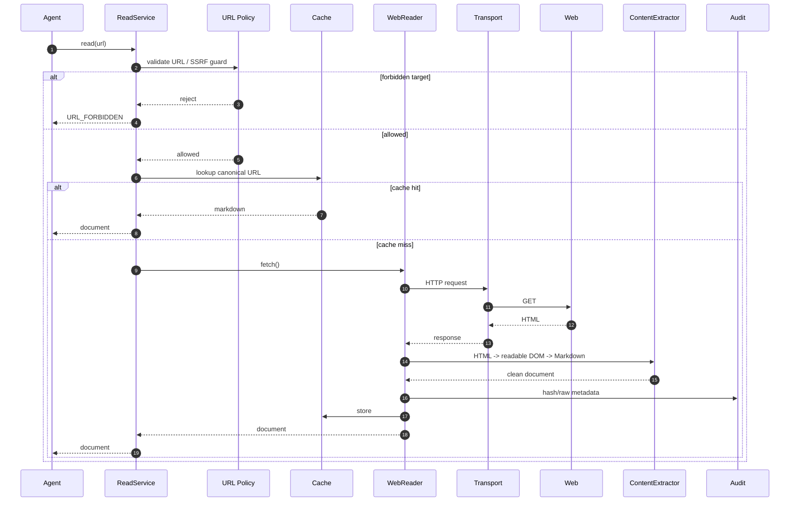
```mermaid
sequenceDiagram
    autonumber

    participant Agent
    participant Read as ReadService
    participant Policy as URL Policy
    participant Cache
    participant Reader as WebReader
    participant Transport
    participant Web
    participant Extract as ContentExtractor
    participant Audit

    Agent->>Read: read(url)
    Read->>Policy: validate URL / SSRF guard

    alt forbidden target
        Policy-->>Read: reject
        Read-->>Agent: URL_FORBIDDEN
    else allowed
        Policy-->>Read: allowed
        Read->>Cache: lookup canonical URL

        alt cache hit
            Cache-->>Read: markdown
            Read-->>Agent: document
        else cache miss
            Read->>Reader: fetch()
            Reader->>Transport: HTTP request
            Transport->>Web: GET
            Web-->>Transport: HTML
            Transport-->>Reader: response

            Reader->>Extract: HTML -> readable DOM -> Markdown
            Extract-->>Reader: clean document
            Reader->>Audit: hash/raw metadata
            Reader->>Cache: store
            Reader-->>Read: document
            Read-->>Agent: document
        end
    end
```

---

## 24. SSRF 防护

Read URL 来自 Agent，因此必须视为不可信输入。

默认拒绝：

- localhost；
- 127.0.0.0/8；
- ::1；
- RFC1918 private network；
- link-local；
- cloud metadata；
- 非 http/https scheme；
- DNS rebinding 后解析为内网地址；
- 重定向到禁止网段。

建议：

```text
URL parse
  ↓
scheme allowlist
  ↓
DNS resolve
  ↓
IP classification
  ↓
network policy
  ↓
connect
  ↓
redirect
  ↓
重新执行完整校验
```

任何 redirect 都重新做 SSRF 检查。

---

## 25. Deduplication

多个 Provider 很容易返回同一网页。

建议分层：

### 第一层：Canonical URL

- 去 fragment；
- normalize trailing slash；
- 清除常见 tracking params；
- provider 给出的 canonicalUrl 优先。

### 第二层：Content fingerprint

```text
normalized title
+
normalized snippet
+
host
```

计算 hash。

### 第三层：近似重复

后续可选 MinHash / SimHash。

---

## 26. Ranking

V1 不需要 LLM。

建议基础分：

```text
finalScore =
    providerScore   * 0.40
  + freshnessScore * 0.20
  + qualityScore   * 0.15
  + relevanceScore * 0.15
  + diversityScore * 0.10
```

权重配置化。

之后可以增加：

- BM25；
- embedding cosine similarity；
- cross encoder reranker；
- LLM rerank。

---

## 27. Source Diversity

防止 Top 20 全部来自同一来源。

例如：

```yaml
ranking:
  diversity:
    maxPerProvider: 8
    maxPerDomain: 4
    maxPerPlatform: 8
```

对于社交结果，可以额外：

```text
maxPerAuthor
```

---

## 28. Cache 设计

缓存分三层。

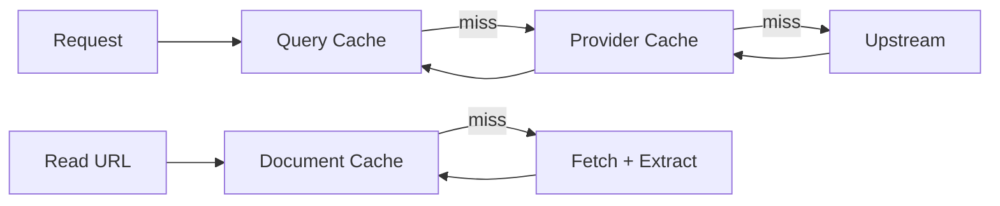
```mermaid
flowchart LR
    REQ["Request"] --> Q["Query Cache"]
    Q -->|miss| P["Provider Cache"]
    P -->|miss| UP["Upstream"]
    UP --> P
    P --> Q

    READ["Read URL"] --> D["Document Cache"]
    D -->|miss| WEB["Fetch + Extract"]
    WEB --> D
```

### 28.1 Query Cache

Key：

```text
hash(
  normalized_query
  + providers
  + language
  + freshness
  + filters
  + schema_version
)
```

### 28.2 Provider Cache

避免同一个 upstream query 被多个请求重复请求。

### 28.3 Document Cache

Key：

```text
canonical_url + reader_version
```

对于实时平台缓存 TTL 应较短。

---

## 29. Audit 设计

审计是 Aylens 的一等能力。

每一个顶层请求：

```text
request_id
trace_id
caller
created_at
completed_at
status
```

每个 Provider 调用：

```text
provider_request_id
request_id
provider
provider_type
provider_version
execution_id
runtime_id / runner_id
runtime_version
execution_mode
browser_profile_id（如有）
browser_type / browser_version（如有）
transport
proxy endpoint logical id（不得包含凭据）
attempt
status
http status
latency
result count
error code
raw payload hash
normalized payload hash
```

---

## 30. 审计链路

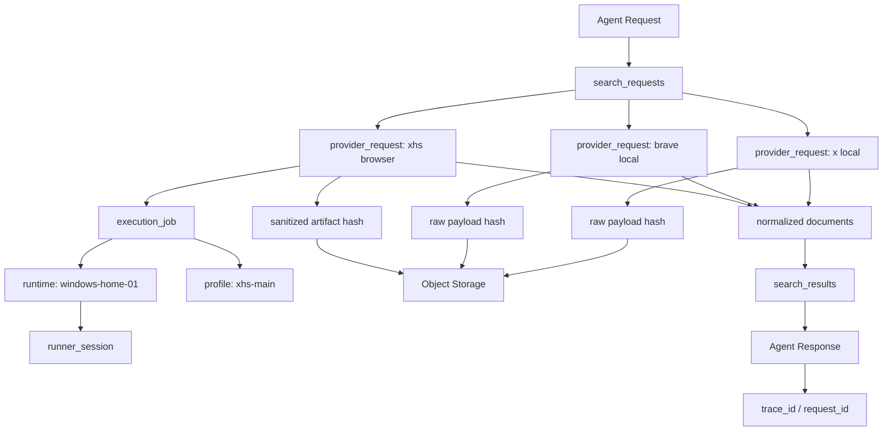
```mermaid
flowchart TD
    AG["Agent Request"] --> SR["search_requests"]
    SR --> PR1["provider_request: x local"]
    SR --> PR2["provider_request: brave local"]
    SR --> PR3["provider_request: xhs browser"]

    PR3 --> JOB["execution_job"]
    JOB --> RT["runtime: windows-home-01"]
    RT --> SESSION["runner_session"]
    JOB --> PROFILE["profile: xhs-main"]

    PR1 --> RAW1["raw payload hash"]
    PR2 --> RAW2["raw payload hash"]
    PR3 --> RAW3["sanitized artifact hash"]

    RAW1 --> OBJ["Object Storage"]
    RAW2 --> OBJ
    RAW3 --> OBJ

    PR1 --> DOC["normalized documents"]
    PR2 --> DOC
    PR3 --> DOC

    DOC --> FINAL["search_results"]
    FINAL --> RESP["Agent Response"]

    RESP --> TRACE["trace_id / request_id"]
```

目标是能回答：

> Agent 为什么会看到这条信息？

沿着：

```text
Agent answer
  ↓
retrieval request_id
  ↓
search result
  ↓
normalized document
  ↓
provider request
  ↓
raw payload hash
  ↓
upstream source
```

完整回溯。

---

## 31. 敏感字段审计策略

不得记录：

- Authorization；
- Cookie；
- API Key；
- Proxy password；
- OAuth access token；
- session token。

统一 redaction：

```text
authorization -> [REDACTED]
cookie -> [REDACTED]
set-cookie -> [REDACTED]
x-api-key -> [REDACTED]
proxy-authorization -> [REDACTED]
```

Raw payload 写 Object Storage 前也需要 provider-specific sanitizer。

---

## 32. 数据库模型

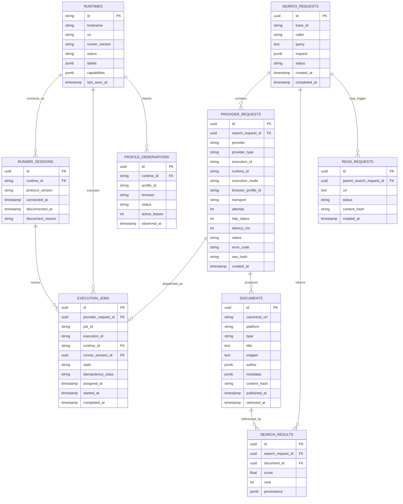
```mermaid
erDiagram
    SEARCH_REQUESTS ||--o{ PROVIDER_REQUESTS : contains
    SEARCH_REQUESTS ||--o{ SEARCH_RESULTS : returns
    SEARCH_REQUESTS ||--o{ READ_REQUESTS : may_trigger

    PROVIDER_REQUESTS ||--o| EXECUTION_JOBS : dispatched_as
    PROVIDER_REQUESTS ||--o{ DOCUMENTS : produces
    DOCUMENTS ||--o{ SEARCH_RESULTS : referenced_by

    RUNTIMES ||--o{ RUNNER_SESSIONS : connects_as
    RUNTIMES ||--o{ EXECUTION_JOBS : executes
    RUNTIMES ||--o{ PROFILE_OBSERVATIONS : reports
    RUNNER_SESSIONS ||--o{ EXECUTION_JOBS : carries

    SEARCH_REQUESTS {
        uuid id PK
        string trace_id
        string caller
        text query
        jsonb request
        string status
        timestamp created_at
        timestamp completed_at
    }

    PROVIDER_REQUESTS {
        uuid id PK
        uuid search_request_id FK
        string provider
        string provider_type
        string execution_id
        string runtime_id
        string execution_mode
        string browser_profile_id
        string transport
        int attempt
        int http_status
        int latency_ms
        string status
        string error_code
        string raw_hash
        timestamp created_at
    }

    RUNTIMES {
        string id PK
        string hostname
        string os
        string runner_version
        string status
        jsonb labels
        jsonb capabilities
        timestamp last_seen_at
    }

    RUNNER_SESSIONS {
        uuid id PK
        string runtime_id FK
        string protocol_version
        timestamp connected_at
        timestamp disconnected_at
        string disconnect_reason
    }

    EXECUTION_JOBS {
        uuid id PK
        uuid provider_request_id FK
        string job_id
        string execution_id
        string runtime_id FK
        uuid runner_session_id FK
        string state
        string idempotency_class
        timestamp assigned_at
        timestamp started_at
        timestamp completed_at
    }

    PROFILE_OBSERVATIONS {
        uuid id PK
        string runtime_id FK
        string profile_id
        string browser
        string status
        int active_leases
        timestamp observed_at
    }

    DOCUMENTS {
        uuid id PK
        string canonical_url
        string platform
        string type
        text title
        text snippet
        jsonb author
        jsonb metadata
        string content_hash
        timestamp published_at
        timestamp retrieved_at
    }

    SEARCH_RESULTS {
        uuid id PK
        uuid search_request_id FK
        uuid document_id FK
        float score
        int rank
        jsonb provenance
    }

    READ_REQUESTS {
        uuid id PK
        uuid parent_search_request_id FK
        text url
        string status
        string content_hash
        timestamp created_at
    }
```

`Runtime Registry` 的实时在线状态可以放 Redis/内存；PostgreSQL 中的 `RUNTIMES / RUNNER_SESSIONS / EXECUTION_JOBS` 主要用于审计、重连 reconciliation 与历史追踪。

---

## 33. Raw Payload 存储

不建议把大 HTML / JSON 全塞 PostgreSQL。

建议：

```text
S3 / MinIO / R2

audit/
  2026/
    09/
      20/
        srch_01K.../
          x-official/
            attempt-1.json.gz
          brave/
            attempt-1.json.gz

documents/
  sha256/
    ab/
      abcdef....html.gz
```

Postgres 只保存 object key + hash。

---

## 34. 错误模型

统一错误码：

```ts
export type RetrievalErrorCode =
  | "INVALID_REQUEST"
  | "AUTH_FAILED"
  | "PROVIDER_DISABLED"
  | "PROVIDER_UNAVAILABLE"
  | "NO_COMPATIBLE_RUNTIME"
  | "RUNTIME_OFFLINE"
  | "RUNNER_LOST"
  | "PROFILE_BUSY"
  | "PROFILE_AUTH_REQUIRED"
  | "BROWSER_START_FAILED"
  | "RATE_LIMITED"
  | "TIMEOUT"
  | "NETWORK_ERROR"
  | "PROXY_FAILED"
  | "NETWORK_POLICY_REJECTED"
  | "UPSTREAM_AUTH_FAILED"
  | "UPSTREAM_ERROR"
  | "PARSE_ERROR"
  | "BLOCKED"
  | "URL_FORBIDDEN"
  | "CONTENT_UNAVAILABLE"
  | "INTERNAL_ERROR";
```

错误携带：

```ts
{
  code: RetrievalErrorCode;
  retryable: boolean;
  provider?: string;
  requestId: string;
}
```

外部 API 返回时不得暴露 upstream secret 或 proxy address。

---

## 35. Partial Success

多个 Provider 同时执行时，一个失败不应该默认让整个 Search 失败。

规则：

```text
至少一个 Provider 成功
    => completed / partial

所有 Provider 失败
    => failed
```

例如：

```json
{
  "status": "partial",
  "items": [],
  "meta": {
    "providers": {
      "brave": {
        "status": "success"
      },
      "x-official": {
        "status": "failed",
        "error": {
          "code": "PROXY_FAILED",
          "retryable": true
        }
      }
    }
  }
}
```

---

## 36. Provider Health

Provider、Runtime 与 Transport 分别维护健康状态，避免把“平台故障”“执行节点离线”和“代理故障”混为一谈。

Provider：

```text
healthy
degraded
unhealthy
disabled
```

Runtime / Runner：

```text
online
degraded
draining
offline
```

Transport：

```text
proxy-us: healthy
proxy-us-backup: healthy
proxy-cn: degraded
```

Browser Profile 还应暴露：

```text
READY
LEASED
AUTH_REQUIRED
BROKEN
OFFLINE
```

Router 可以避开 unhealthy Provider；Execution Dispatcher 只选择满足 capability 且 online 的 Runtime；Transport Manager 避开 unhealthy proxy endpoint。

---

## 37. Circuit Breaker

对于持续失败的 Provider/Proxy：

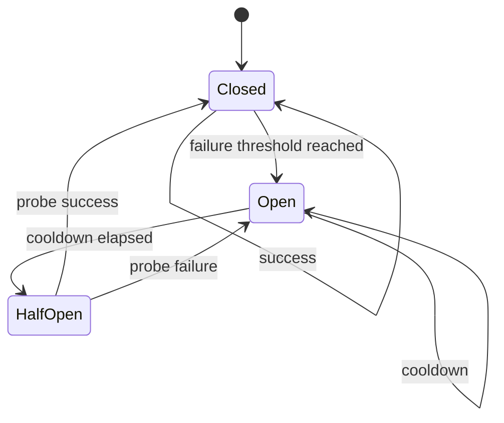
```mermaid
stateDiagram-v2
    [*] --> Closed
    Closed --> Closed: success
    Closed --> Open: failure threshold reached
    Open --> Open: cooldown
    Open --> HalfOpen: cooldown elapsed
    HalfOpen --> Closed: probe success
    HalfOpen --> Open: probe failure
```

防止上游宕机时产生请求风暴。

---

## 38. 限流与并发

至少需要三层 limiter：

```text
Global concurrency
Provider concurrency
Caller rate limit
```

后续可加：

```text
Proxy endpoint concurrency
Account/token concurrency
```

配置：

```yaml
providers:
  x-official:
    limits:
      concurrency: 4
      requestsPerSecond: 2

  brave:
    limits:
      concurrency: 10
      requestsPerSecond: 5
```

---

## 39. 推荐完整配置

```yaml
version: 1

server:
  host: 0.0.0.0
  port: 3000

api:
  auth:
    type: api-key
    keys:
      - "${AYLENS_API_KEY}"

database:
  url: "${DATABASE_URL}"

redis:
  url: "${REDIS_URL}"

objectStorage:
  type: s3
  endpoint: "${S3_ENDPOINT}"
  bucket: "${S3_BUCKET}"
  accessKeyId: "${S3_ACCESS_KEY_ID}"
  secretAccessKey: "${S3_SECRET_ACCESS_KEY}"

runtimeRegistry:
  runnerHeartbeatTimeoutSeconds: 30
  runnerOfflineAfterSeconds: 60
  jobLeaseSeconds: 120

  connection:
    type: websocket
    path: /v1/runners/connect

runtimePolicies:
  windows-browser:
    selector:
      os: windows
      capabilities:
        browser: chrome

  any-http:
    selector:
      capabilities:
        http: true

networkPolicies:
  default:
    allowDirect: true
    allowProxy: true

  proxy-only:
    allowDirect: false
    allowProxy: true

  direct-only:
    allowDirect: true
    allowProxy: false

transports:
  direct:
    type: direct

  proxy-us:
    type: http-proxy
    url: "${PROXY_US_URL}"
    timeout:
      connectMs: 5000
      requestMs: 15000

  proxy-us-backup:
    type: http-proxy
    url: "${PROXY_US_BACKUP_URL}"

  proxy-cn:
    type: socks5
    url: "${PROXY_CN_URL}"

  residential-us:
    type: proxy-pool
    strategy: round-robin
    endpoints:
      - "${PROXY_RESIDENTIAL_US_01}"
      - "${PROXY_RESIDENTIAL_US_02}"
    health:
      enabled: true
      failureThreshold: 3
      cooldownSeconds: 60

retryPolicies:
  api-default:
    attempts: 2
    backoff: exponential
    baseDelayMs: 200
    maxDelayMs: 2000

providers:
  brave:
    type: brave
    enabled: true

    runtime:
      selector:
        capabilities:
          http: true

    credentials:
      apiKey: "${BRAVE_API_KEY}"

    networkPolicy: direct-only

    transport:
      primary: direct

    retryPolicy: api-default

    limits:
      concurrency: 10

  x-official:
    type: x-api
    enabled: true

    runtime:
      selector:
        capabilities:
          http: true

    credentials:
      bearerToken: "${X_BEARER_TOKEN}"

    networkPolicy: proxy-only

    transport:
      primary: proxy-us
      fallback:
        - proxy-us-backup

    retryPolicy: api-default

    limits:
      concurrency: 4

  zhihu-web:
    type: site-search
    enabled: true

    networkPolicy: default

    transport:
      primary: proxy-cn

    options:
      domain: zhihu.com
      searchProvider: brave

  xiaohongshu-web:
    type: site-search
    enabled: true

    networkPolicy: default

    transport:
      primary: proxy-cn

    options:
      domain: xiaohongshu.com
      searchProvider: brave

  xiaohongshu-browser:
    type: xiaohongshu-browser
    enabled: true

    runtime:
      selector:
        os: windows
        providerType: xiaohongshu-browser
        browser: chrome
        profile: xhs-main

    browser:
      profile: xhs-main

    # 这是 Runner 本地的逻辑 transport 名称。
    # Gateway 不保存远程代理密码。
    transport:
      primary: proxy-cn

    limits:
      concurrency: 1

  reddit-web:
    type: site-search
    enabled: true

    networkPolicy: direct-only

    transport:
      primary: direct

    options:
      domain: reddit.com
      searchProvider: brave

  generic-web-reader:
    type: web-reader
    enabled: true

    networkPolicy: default

    transport:
      primary: direct

routes:
  default:
    providers:
      - brave

  realtime:
    providers:
      - x-official
      - brave

  chinese-social:
    providers:
      - xiaohongshu-browser
      - zhihu-web
      - xiaohongshu-web
      - brave

  social:
    providers:
      - x-official
      - reddit-web
      - brave

search:
  defaultLimit: 20
  maxLimit: 100
  deadlineMs: 12000

ranking:
  diversity:
    maxPerProvider: 8
    maxPerDomain: 4
    maxPerPlatform: 8

cache:
  enabled: true

  search:
    ttlSeconds: 300

  document:
    ttlSeconds: 3600

audit:
  enabled: true
  storeRawPayload: true
  redactSecrets: true

observability:
  tracing:
    enabled: true

  metrics:
    enabled: true
```

---

### 39.1 分布式模式的 Runner 本地配置

上面的 Gateway 配置描述 Provider、Route 和 Runtime 选择规则。远程 Runtime 的网络出口、Browser Profile 路径与本机 Secret 应保留在 Runner 本地，例如 Windows 电脑：

```yaml
runner:
  id: windows-home-01

  gateway:
    url: "wss://aylens.example.com/v1/runners/connect"
    token: "${AYLENS_RUNNER_TOKEN}"

  labels:
    region: home
    purpose: social-browser

capabilities:
  providers:
    - xiaohongshu-browser
    - zhihu-browser

  browser:
    chrome: true

  http: true

transports:
  direct:
    type: direct

  proxy-cn:
    type: socks5
    url: "${LOCAL_PROXY_CN_URL}"

browserProfiles:
  xhs-main:
    browser: chrome
    persistent: true
    userDataDir: "D:\\Aylens\\profiles\\xhs-main"
    maxConcurrency: 1
    interactive: true

  zhihu-main:
    browser: chrome
    persistent: true
    userDataDir: "D:\\Aylens\\profiles\\zhihu-main"
    maxConcurrency: 1
    interactive: true

secrets:
  scope: local
```

这里的边界非常重要：

- Gateway 只看到 `xhs-main` 这个逻辑 Profile ID；
- Cookie、LocalStorage、IndexedDB、账号密码不上传 Gateway；
- `proxy-cn` 在远程 Provider 场景中解析为 Runner 本地 transport；
- 持久 Chrome Profile 默认与 Runtime 有 affinity；
- Profile 不应放在 NAS 上供多个 Chrome 实例同时写入；
- Profile 迁移必须在浏览器完全停止后进行受控 snapshot/restore。

---

## 40. 配置校验

配置必须启动时 fail-fast。

建议使用 Zod：

```text
load YAML
  ↓
environment interpolation
  ↓
Zod schema validate
  ↓
cross-reference validate
  ↓
secret reference validate
  ↓
build registries
```

Cross-reference 检查包括：

- route 引用的 provider 是否存在；
- retryPolicy 是否存在；
- networkPolicy 是否存在；
- runtime selector/schema 是否合法；
- Browser Provider 是否声明需要的 browser/profile capability；
- proxy-only Provider 是否配置了 direct fallback；
- duplicate provider id；
- unknown provider type。

远程 Runner 的 `profile`、本地 transport 与本地 secret 属于运行期 capability，Gateway 启动时无法完全验证，必须在调度前由 Runtime Registry 再做一次 fail-closed 匹配。

配置错误应阻止服务启动，而不是等第一次请求才发现。

---

## 41. 配置加载流程

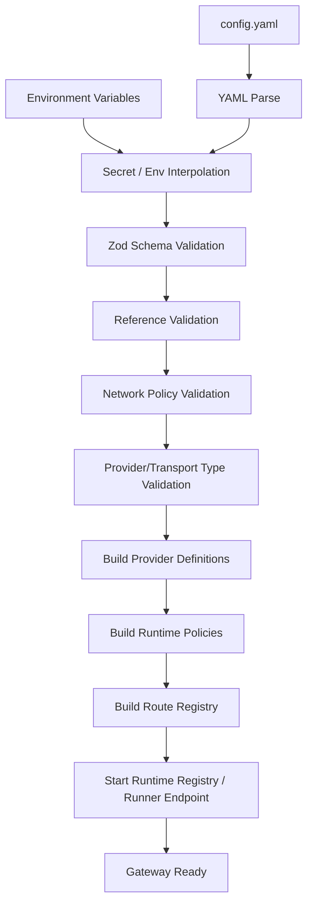
```mermaid
flowchart TD
    FILE["config.yaml"] --> PARSE["YAML Parse"]
    ENV["Environment Variables"] --> INTERP["Secret / Env Interpolation"]
    PARSE --> INTERP

    INTERP --> SCHEMA["Zod Schema Validation"]
    SCHEMA --> REF["Reference Validation"]

    REF --> POLICY["Network Policy Validation"]
    POLICY --> TYPES["Provider/Transport Type Validation"]

    TYPES --> BUILD_P["Build Provider Definitions"]
    BUILD_P --> BUILD_RT["Build Runtime Policies"]
    BUILD_RT --> BUILD_R["Build Route Registry"]
    BUILD_R --> START_REG["Start Runtime Registry / Runner Endpoint"]

    START_REG --> READY["Gateway Ready"]
```

---

## 42. 目录结构

推荐：

```text
src/
├── app/
│   ├── bootstrap.ts
│   └── context.ts
│
├── api/
│   ├── http/
│   │   ├── routes/
│   │   │   ├── search.ts
│   │   │   ├── read.ts
│   │   │   ├── audit.ts
│   │   │   └── health.ts
│   │   └── server.ts
│   └── mcp/
│       ├── tools/
│       └── server.ts
│
├── config/
│   ├── schema.ts
│   ├── loader.ts
│   ├── interpolate.ts
│   └── validate-references.ts
│
├── core/
│   ├── search/
│   │   ├── search-service.ts
│   │   ├── planner.ts
│   │   ├── router.ts
│   │   ├── executor.ts
│   │   ├── normalizer.ts
│   │   ├── deduplicator.ts
│   │   └── ranker.ts
│   │
│   ├── read/
│   │   ├── read-service.ts
│   │   ├── url-policy.ts
│   │   └── content-extractor.ts
│   │
│   ├── audit/
│   │   └── audit-service.ts
│   │
│   └── errors/
│       └── retrieval-error.ts
│
├── providers/
│   ├── registry.ts
│   ├── factory.ts
│   ├── types.ts
│   │
│   ├── brave/
│   │   ├── factory.ts
│   │   ├── provider.ts
│   │   ├── mapper.ts
│   │   └── schema.ts
│   │
│   ├── x-api/
│   │   ├── factory.ts
│   │   ├── provider.ts
│   │   ├── mapper.ts
│   │   └── schema.ts
│   │
│   ├── site-search/
│   │   ├── factory.ts
│   │   └── provider.ts
│   │
│   └── web-reader/
│       ├── factory.ts
│       ├── provider.ts
│       └── extractor.ts
│
├── runtime/
│   ├── registry.ts
│   ├── dispatcher.ts
│   ├── scheduler.ts
│   ├── selector.ts
│   ├── job-state.ts
│   ├── runner-session.ts
│   └── protocol/
│       ├── messages.ts
│       └── schemas.ts
│
├── browser/
│   ├── manager.ts
│   ├── profile-manager.ts
│   ├── profile-lease.ts
│   └── types.ts
│
├── transports/
│   ├── registry.ts
│   ├── types.ts
│   ├── manager.ts
│   ├── network-policy.ts
│   │
│   ├── direct/
│   ├── http-proxy/
│   ├── socks5/
│   └── proxy-pool/
│
├── infrastructure/
│   ├── db/
│   │   ├── schema/
│   │   └── repositories/
│   ├── redis/
│   ├── storage/
│   ├── queue/
│   ├── telemetry/
│   └── metrics/
│
└── shared/
    ├── ids/
    ├── time/
    └── hashing/
```

Runner 建议使用同一 monorepo 的独立入口，复用 Provider、Transport 和协议类型：

```text
apps/
├── gateway/
│   └── src/
│
└── runner/
    └── src/
        ├── main.ts
        ├── connection/
        ├── jobs/
        ├── browser/
        └── local-secrets/

packages/
├── contracts/
├── providers/
├── transports/
└── browser-runtime/
```

---

## 43. Node.js 技术选型

建议：

| 能力 | 技术 |
|---|---|
| Runtime | Node.js 24+ |
| Language | TypeScript |
| HTTP Server | Fastify |
| Schema | Zod / TypeBox |
| DB | PostgreSQL |
| ORM | Drizzle |
| Cache | Redis |
| Queue | BullMQ |
| HTTP | native fetch / undici |
| Logging | Pino |
| Trace | OpenTelemetry |
| Metrics | Prometheus |
| HTML | JSDOM |
| Readability | Mozilla Readability |
| Browser | Playwright + installed Google Chrome / CDP |
| API Docs | OpenAPI |
| Agent Protocol | MCP |
| Test | Vitest |
| Container | Docker |

---

## 44. Logging

日志必须结构化。

例如：

```json
{
  "level": "info",
  "event": "provider.completed",
  "request_id": "srch_01K...",
  "trace_id": "trace_01K...",
  "provider": "x-official",
  "transport": "proxy-us",
  "attempt": 1,
  "latency_ms": 312,
  "result_count": 10
}
```

绝不直接打印：

```text
Authorization
Proxy URL with credentials
Cookie
raw HTML
entire upstream body
```

---

## 45. Metrics

核心 metrics：

```text
aylens_search_requests_total
aylens_search_latency_seconds
aylens_provider_requests_total
aylens_provider_latency_seconds
aylens_provider_errors_total
aylens_transport_requests_total
aylens_transport_errors_total
aylens_proxy_health
aylens_cache_hits_total
aylens_cache_misses_total
aylens_read_requests_total
aylens_search_results_total
```

建议标签：

```text
provider
transport
status
error_code
route
```

避免把 query、URL 直接做 metric label，防止基数爆炸。

---

## 46. Trace

一个 Search Request 使用同一 trace：

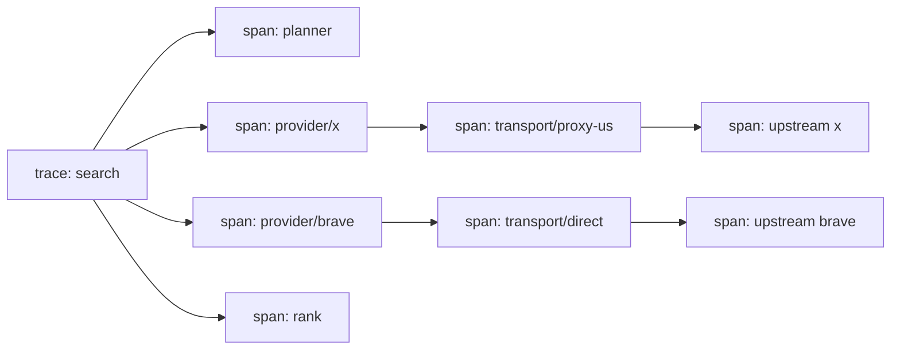
```mermaid
flowchart LR
    T["trace: search"] --> S1["span: planner"]
    T --> S2["span: provider/x"]
    T --> S3["span: provider/brave"]
    T --> S4["span: rank"]

    S2 --> X1["span: transport/proxy-us"]
    S3 --> B1["span: transport/direct"]

    X1 --> U1["span: upstream x"]
    B1 --> U2["span: upstream brave"]
```

这样可以快速定位：

- 慢在 Router？
- Provider？
- Proxy？
- Upstream？
- Ranker？

---

## 47. Site Search Provider

第一版非常值得做通用 SiteSearchProvider。

输入：

```yaml
zhihu-web:
  type: site-search
  options:
    domain: zhihu.com
    searchProvider: brave
```

内部：

```text
query = "Claude Code"
domain = "zhihu.com"

↓ rewrite

"Claude Code site:zhihu.com"

↓ delegate

BraveProvider
```

同一个 Provider 实现即可快速支持：

- 知乎；
- 小红书；
- Reddit；
- StackOverflow；
- GitHub；
- Medium；
- Hacker News。

等确定某个平台需要更丰富数据后，再增加专用 Provider。

---

## 48. Provider 组合而不是继承

不要建立：

```text
BaseProvider
  ↓
BaseSearchProvider
    ↓
BaseSocialSearchProvider
      ↓
XProvider
```

容易形成脆弱继承树。

建议：

```text
Provider
 +
Transport
 +
RetryPolicy
 +
RateLimiter
 +
Mapper
 +
Capabilities
```

通过组合完成。

---

## 49. 一个新 Provider 的扩展流程

假设增加 `SomeSearch`。

### Step 1

实现：

```text
providers/some-search/
  factory.ts
  provider.ts
  mapper.ts
  schema.ts
```

### Step 2

注册 type：

```ts
providerRegistry.register(
  "some-search",
  new SomeSearchProviderFactory()
);
```

### Step 3

配置：

```yaml
providers:
  some:
    type: some-search
    enabled: true

    credentials:
      apiKey: "${SOME_API_KEY}"

    transport:
      primary: proxy-us
```

### Step 4

加入 route：

```yaml
routes:
  default:
    providers:
      - some
      - brave
```

SearchService 不需要修改。

---

## 50. 分布式部署拓扑

Aylens 的推荐部署形态不再是“所有 Provider 都塞进 Gateway”，而是 **一个中心 Control Plane + 多个可选 Runner**。Gateway 仍保持模块化单体；分布式只发生在 Provider Execution 边界，因此不需要把 Search、Audit、Ranker 等拆成微服务。

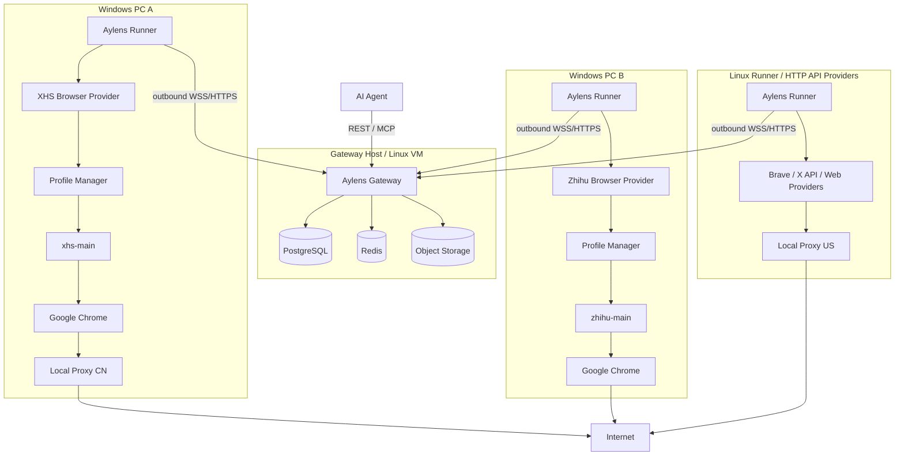
```mermaid
flowchart TB
    AGENT["AI Agent"] -->|"REST / MCP"| GW

    subgraph CoreHost["Gateway Host / Linux VM"]
        GW["Aylens Gateway"]
        PG[("PostgreSQL")]
        REDIS[("Redis")]
        OBJ[("Object Storage")]
    end

    subgraph CloudRunner["Linux Runner / HTTP API Providers"]
        RH["Aylens Runner"]
        HTTP["Brave / X API / Web Providers"]
        PH["Local Proxy US"]
    end

    subgraph HomePC["Windows PC A"]
        RA["Aylens Runner"]
        XHS["XHS Browser Provider"]
        PMA["Profile Manager"]
        PA["xhs-main"]
        CHA["Google Chrome"]
        PXA["Local Proxy CN"]
    end

    subgraph OfficePC["Windows PC B"]
        RB["Aylens Runner"]
        ZH["Zhihu Browser Provider"]
        PMB["Profile Manager"]
        PB["zhihu-main"]
        CHB["Google Chrome"]
    end

    GW --> PG
    GW --> REDIS
    GW --> OBJ

    RA -->|"outbound WSS/HTTPS"| GW
    RB -->|"outbound WSS/HTTPS"| GW
    RH -->|"outbound WSS/HTTPS"| GW

    RA --> XHS --> PMA --> PA
    PA --> CHA --> PXA --> NET["Internet"]

    RB --> ZH --> PMB --> PB
    PB --> CHB --> NET

    RH --> HTTP --> PH --> NET
```

Runner 默认主动连接 Gateway，而不是让 Gateway 主动访问 Windows 节点。这样远程电脑无需公网 IP、端口映射或开放入站 RPC 端口，只需要允许 outbound HTTPS/WSS。

---

## 51. Distributed Execution Runtime 与 Aylens Runner

### 51.1 Execution Runtime 抽象

Provider 从不运行于 Gateway 进程。

建议抽象：

```ts
export interface ExecutionRuntime {
  readonly id: string;

  execute<TInput, TOutput>(
    request: RuntimeExecutionRequest<TInput>
  ): Promise<TOutput>;

  health(): Promise<RuntimeHealth>;

  capabilities(): Promise<RuntimeCapabilities>;
}
```

V1 实现：

```text
RemoteRunnerRuntime
```

Gateway 自身不是 Runtime，也不注册进 Runtime Registry。

Gateway 调用链由：

```text
provider.search(request)
```

升级为：

```text
Provider Definition
  ↓
Execution Dispatcher
  ↓
Runtime Selection
  ↓
Provider Operation
```

Provider 实例 ID、Provider 类型与执行位置必须分离：

```yaml
providers:
  xiaohongshu-main:
    type: xiaohongshu-browser

    runtime:
      selector:
        os: windows
        browser: chrome
        profile: xhs-main
```

其中：

```text
xiaohongshu-main      = Provider Instance
xiaohongshu-browser   = Provider Implementation Type
windows-home-01       = Runtime / Runner
xhs-main              = Runtime-local Browser Profile
```

### 51.2 Runtime Registry

Gateway 维护 Runtime Registry。每个 Runner 建立连接后注册：

```ts
export interface RuntimeRegistration {
  nodeId: string;
  hostname: string;
  os: "windows" | "linux" | "darwin";
  runnerVersion: string;

  capabilities: {
    providerTypes: string[];
    browsers: string[];
    profiles: string[];
    http: boolean;
    browserAutomation: boolean;
  };

  labels: Record<string, string>;

  capacity: {
    maxJobs: number;
    activeJobs: number;
  };
}
```

Runtime 状态：

```text
ONLINE
DEGRADED
DRAINING
OFFLINE
```

状态来源包括：

- 心跳；
- Runner 版本；
- Job capacity；
- Browser health；
- Profile health；
- Runner 本地 Transport health。

### 51.3 Runtime Selector

Provider 可以绑定固定节点：

```yaml
runtime:
  nodeId: windows-home-01
```

更推荐使用 capability selector：

```yaml
runtime:
  selector:
    os: windows
    providerType: xiaohongshu-browser
    browser: chrome
    profile: xhs-main
    labels:
      purpose: social-browser
```

调度流程：

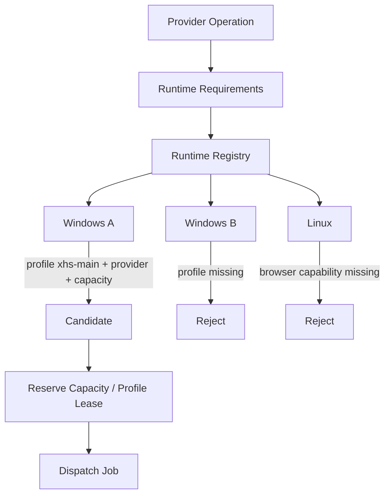
```mermaid
flowchart TD
    JOB["Provider Operation"] --> REQ["Runtime Requirements"]
    REQ --> REG["Runtime Registry"]
    REG --> A["Windows A"]
    REG --> B["Windows B"]
    REG --> C["Linux"]

    A -->|"profile xhs-main + provider + capacity"| CAND["Candidate"]
    B -->|"profile missing"| REJECT1["Reject"]
    C -->|"browser capability missing"| REJECT2["Reject"]

    CAND --> LEASE["Reserve Capacity / Profile Lease"]
    LEASE --> EXEC["Dispatch Job"]
```

如果没有兼容节点，应明确返回：

```text
NO_COMPATIBLE_RUNTIME
```

而不是偷偷退化到错误的主机。

### 51.4 Runner 连接协议

V1 推荐 Runner 使用 **outbound WebSocket over TLS**。

Runner -> Gateway：

```text
REGISTER
HEARTBEAT
CAPABILITY_UPDATE
JOB_ACCEPTED
JOB_STARTED
JOB_PROGRESS
JOB_RESULT
JOB_ERROR
PROFILE_STATUS
```

Gateway -> Runner：

```text
EXECUTE
CANCEL
PING
DRAIN
RELOAD_CONFIG
```

Runner 建立连接：

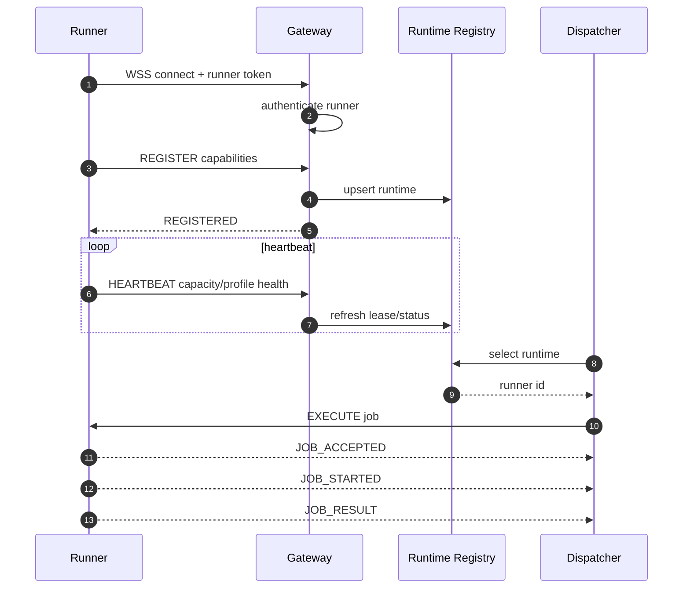
```mermaid
sequenceDiagram
    autonumber

    participant R as Runner
    participant G as Gateway
    participant RR as Runtime Registry
    participant D as Dispatcher

    R->>G: WSS connect + runner token
    G->>G: authenticate runner
    R->>G: REGISTER capabilities
    G->>RR: upsert runtime
    G-->>R: REGISTERED

    loop heartbeat
        R->>G: HEARTBEAT capacity/profile health
        G->>RR: refresh lease/status
    end

    D->>RR: select runtime
    RR-->>D: runner id
    D->>R: EXECUTE job
    R-->>D: JOB_ACCEPTED
    R-->>D: JOB_STARTED
    R-->>D: JOB_RESULT
```

协议消息必须带：

```text
protocol_version
message_id
runner_id
session_id
job_id（任务消息）
execution_id（执行尝试）
timestamp
```

### 51.5 Remote Job 状态机

远程执行不能只用 Promise 成功/失败表示。

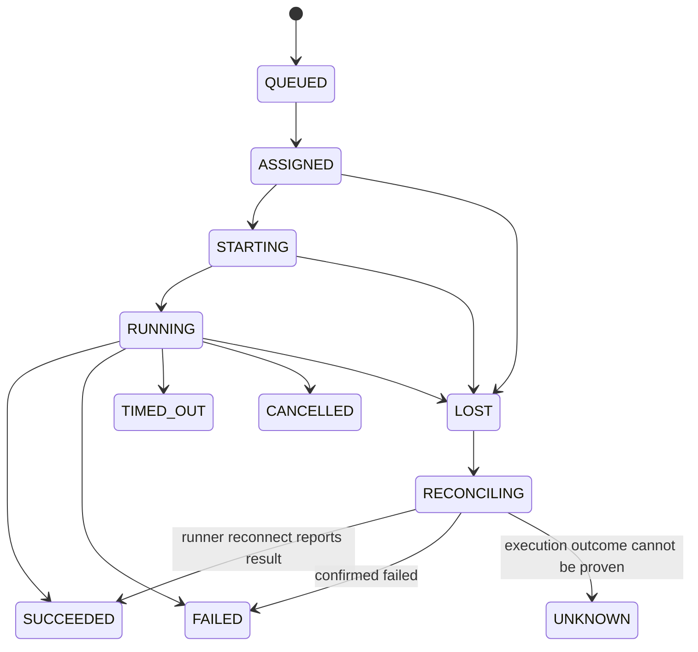
```mermaid
stateDiagram-v2
    [*] --> QUEUED
    QUEUED --> ASSIGNED
    ASSIGNED --> STARTING
    STARTING --> RUNNING
    RUNNING --> SUCCEEDED
    RUNNING --> FAILED
    RUNNING --> TIMED_OUT
    RUNNING --> CANCELLED
    ASSIGNED --> LOST
    STARTING --> LOST
    RUNNING --> LOST
    LOST --> RECONCILING
    RECONCILING --> SUCCEEDED: runner reconnect reports result
    RECONCILING --> FAILED: confirmed failed
    RECONCILING --> UNKNOWN: execution outcome cannot be proven
```

关键点：

- Runner 断线不等于任务没有执行；
- Gateway timeout 不等于浏览器动作没有发生；
- 每次 execution 有独立 `execution_id`；
- `job_id` 表示逻辑任务，`execution_id` 表示某次尝试；
- 只读 Search/Read 可以按策略重试；
- 将来如果出现点赞、评论、发帖等有副作用能力，不能对 `UNKNOWN` 自动重试。

建议 operation 声明：

```ts
type IdempotencyClass =
  | "safe"
  | "conditional"
  | "unsafe";
```

### 51.6 Browser Runtime

Browser Provider 不通过 Gateway 远程发送低层 DOM 指令，而是把完整 Provider Operation 下发给 Runner。

不推荐：

```text
Gateway
  -> click
  -> wait
  -> selector
  -> scroll
  -> click
```

推荐：

```text
Gateway
  -> execute(provider=xiaohongshu-main, operation=search, query=...)
  -> Runner 本机完成全部 Playwright / Chrome 行为
  -> 返回统一 ProviderSearchResponse
```

原因：

- 减少远程往返；
- 浏览器状态与页面操作在本机闭环；
- 网络短暂抖动不会破坏每一步 DOM automation；
- Provider 版本更容易独立测试；
- Login/Profile 状态不会跨网络暴露。

完整流程：

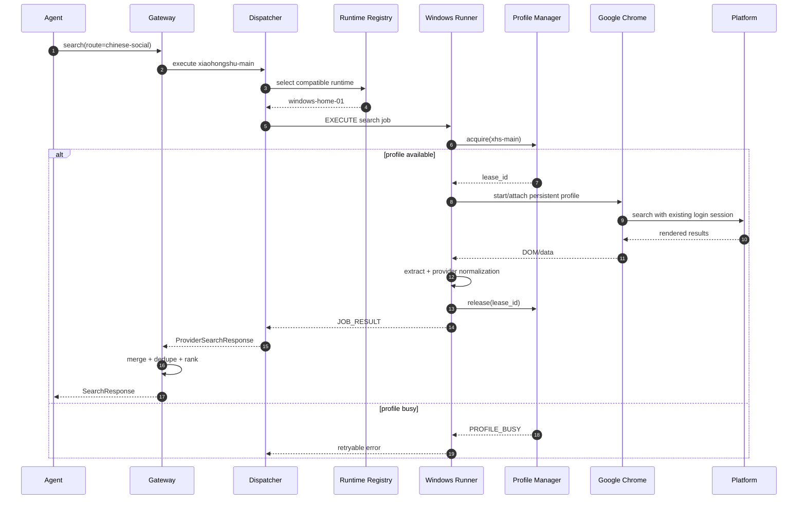
```mermaid
sequenceDiagram
    autonumber

    participant A as Agent
    participant G as Gateway
    participant D as Dispatcher
    participant RR as Runtime Registry
    participant R as Windows Runner
    participant PM as Profile Manager
    participant C as Google Chrome
    participant X as Platform

    A->>G: search(route=chinese-social)
    G->>D: execute xiaohongshu-main
    D->>RR: select compatible runtime
    RR-->>D: windows-home-01

    D->>R: EXECUTE search job
    R->>PM: acquire(xhs-main)

    alt profile available
        PM-->>R: lease_id
        R->>C: start/attach persistent profile
        C->>X: search with existing login session
        X-->>C: rendered results
        C-->>R: DOM/data
        R->>R: extract + provider normalization
        R->>PM: release(lease_id)
        R-->>D: JOB_RESULT
        D-->>G: ProviderSearchResponse
        G->>G: merge + dedupe + rank
        G-->>A: SearchResponse
    else profile busy
        PM-->>R: PROFILE_BUSY
        R-->>D: retryable error
    end
```

### 51.7 Browser Profile 与登录态

Browser Profile 是 **Runtime-local stateful resource**。

Gateway 只持有：

```text
profile_id = xhs-main
runtime affinity / requirements
health status
last observed metadata
```

Gateway 不保存：

```text
Cookie value
LocalStorage value
IndexedDB content
账号密码
Chrome Login Data
完整 User Data Directory
```

推荐：

```text
Windows User Session
  ↓
Aylens Runner / Browser Host
  ↓
D:\Aylens\profiles\xhs-main
  ↓
Google Chrome persistent context
```

如果站点需要人工扫码/验证码登录，可以在该 Windows 桌面直接打开对应 Profile 完成登录；Runner 后续复用同一持久 Profile。

### 51.8 Profile Affinity 与迁移

Profile 默认与一台 Runtime 绑定：

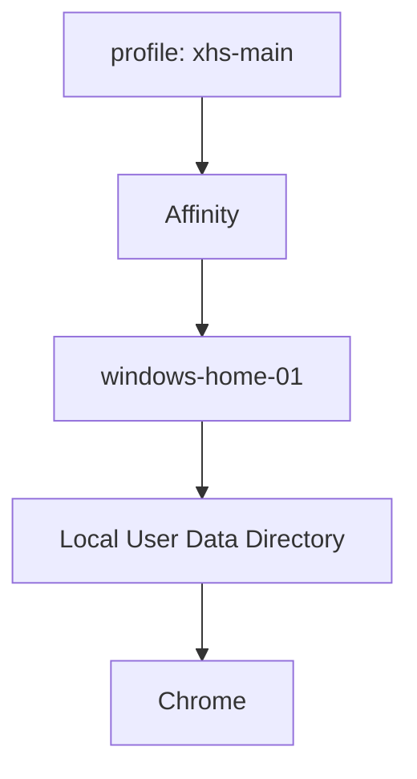
```mermaid
flowchart TD
    P["profile: xhs-main"] --> AFF["Affinity"]
    AFF --> W["windows-home-01"]
    W --> DIR["Local User Data Directory"]
    DIR --> CH["Chrome"]
```

不能因为 `windows-home-01` 离线，就把 `xhs-main` 自动调度到另一台没有登录态的机器。

不建议多个机器同时挂载同一 Chrome Profile 目录。Chrome 会涉及文件锁、SQLite、LevelDB、Local State 等写入，多机共享容易损坏数据。

如果需要迁移：

```text
mark profile DRAINING
  ↓
wait active lease = 0
  ↓
shutdown Chrome
  ↓
encrypted snapshot
  ↓
restore target runtime
  ↓
verify browser/profile
  ↓
update affinity
```

### 51.9 Profile Lease

同一个登录 Profile 默认并发为 1。

```mermaid
sequenceDiagram
    participant J1 as Job A
    participant PM as ProfileManager
    participant J2 as Job B
    participant C as Chrome

    J1->>PM: acquire xhs-main
    PM-->>J1: lease-001
    J1->>C: execute

    J2->>PM: acquire xhs-main
    PM-->>J2: PROFILE_BUSY / queued

    C-->>J1: result
    J1->>PM: release lease-001

    PM-->>J2: lease-002
```

Lease 记录：

```text
lease_id
profile_id
job_id
execution_id
acquired_at
expires_at
runner_session_id
```

Runner crash 后不能立即假设 lease 已安全释放；应在 Runner 重连或 TTL + Chrome process reconciliation 后恢复。

### 51.10 Windows 执行模型

真实 Chrome + 已登录用户场景不一定适合纯 Windows Service，因为 Service 可能运行在不可交互 Session。

V1 可以使用：

```text
Windows 登录用户
  ↓
Startup App / Tray Runner
  ↓
Google Chrome
```

长期可以拆成：

```text
Runner Service
  ↓ local authenticated IPC
Desktop Browser Host
  ↓
Google Chrome
```

这样 Runner 的网络/任务控制可作为 Service，真正需要用户桌面 Session 的 Chrome automation 留在 Desktop Host。

### 51.11 Transport 与 Secret 的 Runtime Locality

分布式后，Transport Registry 是 **每个 Runner 自己的资源**，Gateway 不持有任何 transport。

```text
Windows Runner A
├── direct
├── proxy-cn
└── residential-cn

Windows Runner B
├── direct
└── proxy-office
```

Provider Definition 可以引用逻辑名称：

```yaml
transport:
  primary: proxy-cn
```

但实际 URL、username/password 在选中的 Runtime 本地解析。

这样 Gateway Audit 只记录：

```text
transport = proxy-cn
runtime = windows-home-01
```

而不是代理凭据。

同理，远端 credential 使用逻辑引用：

```yaml
credentials:
  scope: runtime
  ref: xhs-local-account
```

### 51.12 Runner 版本与 Provider 分发

V1 推荐 Runner 安装一组固定 Provider 包并在注册时上报 capability：

```text
@aylens/provider-xiaohongshu-browser
@aylens/provider-zhihu-browser
@aylens/provider-web-reader
```

后续可以演进为插件目录，但必须记录：

```text
runner_version
provider_type
provider_version
browser_version
protocol_version
```

Gateway 在调度时应拒绝不兼容协议版本。

---

## 52. 安全边界

分布式架构下安全边界从“Gateway secrets”扩大为“Gateway + Runner + Browser Profile”。

### 52.1 Gateway Credentials

使用：

```text
ENV / Docker Secret / Vault
```

不得明文提交 config。

### 52.2 Runner 身份

每个 Runner 使用独立身份，不共享一个全局 token。

推荐至少：

```text
runner_id
runner credential
allowed provider types
optional labels/policy
rotation metadata
```

Gateway 必须校验 Runner 是否有权声明和执行某个 Provider type，不能完全信任客户端自报 capability。

### 52.3 Browser Credentials

Cookie、LocalStorage、IndexedDB、Chrome Profile 和账号登录态默认只存在 Runner 本地。

审计中只能记录：

```text
browser_profile_id
auth_state = ready/auth_required
```

不能记录实际登录数据。

### 52.4 Proxy Credentials

代理密码属于 Transport 所在 Runtime 的 Secret。

Gateway 只处理 logical transport id。

### 52.5 Runner 到 Gateway

要求：

- TLS/WSS；
- Runner 鉴权；
- message schema validation；
- job ownership check；
- message size limit；
- heartbeat timeout；
- replay/idempotency protection。

### 52.6 URL Fetch

继续执行 SSRF guard；远端 Runner 也不能绕过 Gateway 定义的 URL policy。策略应随 Job 下发或由受信配置版本约束。

### 52.7 Audit 与 Raw Payload

Raw payload 需要 retention policy，并在 Runner 侧先做 secret redaction 再上传。特别注意浏览器抓取的 HTML 可能包含：

- 用户名；
- 私有 feed；
- csrf token；
- session bootstrap JSON；
- 页面内嵌账号数据。

因此 Browser Provider 默认不应把整页 HTML 无条件上传 Object Storage。

---

## 53. Versioning

统一模型与分布式协议都必须版本化。

API：

```text
/v1/search
/v1/read
```

内部至少记录：

```text
SearchDocument schemaVersion
Runner protocolVersion
Runner version
Provider adapter version
Browser provider version
Normalizer version
Reader version
Chrome version
Profile logical id
```

审计记录这些版本后，才能解释“同一个 Provider 为什么某天开始返回不同结果”。

---

## 54. 推荐启动与连接流程

Gateway 启动：

```mermaid
sequenceDiagram
    autonumber

    participant Main as Gateway
    participant Config
    participant DB
    participant Redis
    participant Registry as Runtime Registry
    participant API

    Main->>Config: load + validate
    Config-->>Main: AppConfig

    Main->>DB: connect + migration check
    Main->>Redis: connect

    Main->>Registry: start runtime registry
    Main->>API: start REST/MCP + Runner WSS endpoint
    API-->>Main: listening

    Main->>Main: ready=true
```

Runner 启动：

```mermaid
sequenceDiagram
    autonumber

    participant R as Runner
    participant CFG as Runner Config
    participant B as Browser/Profile Manager
    participant T as Local Transports
    participant G as Gateway

    R->>CFG: load local config/secrets
    R->>T: initialize transports
    R->>B: inspect Chrome + profiles
    B-->>R: profile health/capabilities

    R->>G: outbound WSS connect
    R->>G: REGISTER capabilities + versions
    G-->>R: accepted

    loop heartbeat
      R->>G: HEARTBEAT capacity/status
    end
```

Gateway 的 `/ready` 不应该要求所有远端 Runner 在线，否则一台家庭 Windows 电脑关机会导致整个网关不 Ready。远端 Provider 的可用性应体现在 Provider/Route 的 runtime availability 中。

---

## 55. 原始 V1 规划范围（历史参考）

由于 Browser/远程主机已经是明确需求，Runner 不应再推迟到 V2。

> 本节以及后续 V2/V3 是原始规划分期，不代表当前实现状态。当前状态请以文档开头的“当前实现快照”和 `docs/` 为准。

### Gateway

- Fastify REST；
- MCP；
- SearchService / ReadService；
- Provider Router；
- Execution Dispatcher；
- Runtime Registry；
- Basic Scheduler；
- Audit；
- Redis Cache；
- PostgreSQL。

### Local Providers

- Brave Search Provider；
- X Official Provider；
- Site Search Provider；
- Generic Web Reader。

### Remote Runtime

- Aylens Runner；
- outbound WSS；
- register / heartbeat；
- EXECUTE / CANCEL；
- Job state；
- Local/Remote execution abstraction。

### Browser

- installed Google Chrome；
- Playwright persistent context 或 CDP attach；
- BrowserProfileManager；
- Profile affinity；
- Profile lease，默认 concurrency=1；
- 至少一个 Browser Provider，例如 xiaohongshu-browser。

### Transport

- Direct；
- HTTP Proxy；
- SOCKS5；
- 每个 Runtime 独立配置。

### Security

- Gateway API Key；
- Runner 独立 credential；
- Browser / proxy secret 只存在于各 Runner 本地；
- SSRF guard；
- secret redaction；
- NetworkPolicy。

V1 暂时不需要自动 Profile 跨机器迁移，也不需要通用插件市场。

---

## 56. V2

增加：

- Proxy Pool；
- Circuit Breaker；
- Runner draining；
- Runtime weighted scheduling；
- Runner reconnect reconciliation；
- Provider package/plugin loading；
- dedicated Zhihu Browser Provider；
- Browser screenshot/debug artifact；
- Profile auth-required notification；
- Object Storage Raw Payload；
- Browser HTML sanitizer；
- source quality；
- embedding rerank。

---

## 57. V3

可以考虑：

- Runner automatic update；
- Browser Profile encrypted backup/migration；
- 多账号 Profile pool；
- Account/Profile scheduler；
- LLM Query Planner；
- multi-query expansion；
- cross-provider query rewrite；
- semantic cache；
- content snapshot/version；
- evidence graph；
- self-hosted reranker；
- research session；
- citation bundle；
- Agent retrieval budget。

---

## 58. 测试策略

### 58.1 Unit

- Config schema；
- runtime selector；
- capability matching；
- profile affinity；
- lease state；
- network policy；
- URL normalization；
- dedupe；
- rank；
- provider mapping；
- error mapping；
- job state transition。

### 58.2 Provider Contract Test

每个 Provider 对固定 fixture：

```text
raw upstream response
    ↓
provider mapper
    ↓
SearchDocument snapshot
```

Browser Provider 应把 DOM fixture 与页面 extractor 尽量拆开，避免所有测试都启动真实浏览器。

### 58.3 Runner Protocol Test

测试：

- register；
- invalid credential；
- heartbeat timeout；
- duplicate message；
- execute；
- cancel；
- lost connection；
- reconnect；
- late result；
- incompatible protocol version；
- malformed result。

### 58.4 Browser Integration

至少覆盖：

- profile available；
- PROFILE_BUSY；
- AUTH_REQUIRED；
- Chrome start failure；
- Chrome crash；
- page timeout；
- Runner disconnect while running；
- lease cleanup/reconciliation。

### 58.5 Network Integration

使用 Mock upstream/proxy 测：

- timeout；
- 429；
- 500；
- malformed JSON；
- proxy failure；
- fallback；
- network policy reject；
- remote transport name missing。

### 58.6 Security

重点测试：

- SSRF；
- redirect SSRF；
- Gateway credentials redaction；
- Runner credentials redaction；
- proxy credentials redaction；
- browser cookies/local storage 不进入 audit；
- direct fallback forbidden；
- Runner 不能冒充未授权 Provider；
- job 不能被错误 Runner 接受；
- stale/replayed job message 不产生重复执行。

---

## 59. 关键验收条件

架构达到 V1 可用标准至少满足：

1. Agent 通过同一个 Search API 使用分布在多个 Runner 上的 Provider；
2. 同一次搜索可以并发 Brave、X API 和 Windows Browser Provider；
3. Gateway 不需要知道 Windows 的真实 Chrome Cookie；
4. Windows Runner 可以主动连接 Gateway，无需开放入站端口；
5. Runner 注册后 Gateway 能看到 capability、capacity 和 profile health；
6. Provider 可以通过 runtime selector 找到兼容机器；
7. 找不到兼容 Runtime 时返回 `NO_COMPATIBLE_RUNTIME`；
8. Provider 可以在不同 Runtime 上使用各自的 direct / HTTP Proxy / SOCKS5；
9. 修改远端代理不需要修改 Provider 代码或 Gateway secret；
10. NetworkPolicy 能阻止非法 direct fallback；
11. Browser Profile 有 runtime affinity；
12. 同一 Profile 默认一次只有一个 lease；
13. Runner 断线后 Job 可以进入 LOST/RECONCILING，而不是被误判为“从未执行”；
14. Browser Search 整体在 Runner 本地运行，不逐步远程控制 DOM；
15. Provider 失败仍可以返回 partial search results；
16. 每条结果带 provenance；
17. Provider audit 能追溯 runtime、execution、provider version、browser profile logical id；
18. Audit 中不存在 Cookie、账号密码、Proxy password；
19. Read API 有 SSRF 防护；
20. REST 与 MCP 复用同一 SearchService；
21. 新增 Runtime 不需要修改 SearchService；
22. 新增 Browser Provider 不需要修改 Dispatcher 核心流程；
23. 一台远端 Windows Runner 离线不会让整个 Gateway `/ready` 失败。

---

## 60. 最终架构总结

Aylens 最终应保持三个平面和六个稳定边界：

```mermaid
flowchart LR
    A["Agent"] --> CP

    subgraph CP["Control Plane"]
        API["REST / MCP"]
        R["Router"]
        D["Execution Dispatcher"]
        RR["Runtime Registry"]
        N["Normalize / Dedupe / Rank"]
        AU["Audit"]
    end

    subgraph EP["Execution Plane"]
        WR0["HTTP / API Runner"]
        WR1["Windows Runner A"]
        WR2["Windows Runner B"]
    end

    subgraph BP["Browser Plane"]
        PM1["Profile Manager"]
        C1["Chrome + xhs-main"]
        PM2["Profile Manager"]
        C2["Chrome + zhihu-main"]
    end

    API --> R --> D
    D --> RR
    D --> WR0
    D --> WR1
    D --> WR2

    WR1 --> PM1 --> C1
    WR2 --> PM2 --> C2

    WR0 --> N
    WR1 --> N
    WR2 --> N
    N --> API

    D -.-> AU
    RR -.-> AU
    N -.-> AU
```

职责可以归纳为：

```text
Router
  = 决定找哪些 Provider

Provider
  = 知道如何访问和理解目标平台

Execution Dispatcher
  = 决定 Provider Operation 去哪里执行

Runtime / Runner
  = 提供机器、浏览器、网络和本地 Secret 能力

Transport / BrowserManager
  = 在该 Runtime 内决定如何访问互联网与如何使用浏览器状态

SearchService + Audit
  = 把执行结果统一成 Agent 可消费、可追溯的结果
```

最终原则：

> **Provider 负责“访问谁”；Dispatcher 负责“去哪里执行”；Runtime 负责“提供什么本地能力”；Transport 负责“怎么出网”；Browser Runtime 负责“如何安全复用浏览器与登录态”；SearchService 负责“最终给 Agent 什么”；Audit 负责“事后解释发生了什么”。**

这意味着以后无论增加 Google、知乎、小红书、Reddit、GitHub、新闻 API，还是增加家庭 Windows 电脑、办公 Windows 电脑、Linux Worker、真实 Chrome、不同登录账号、HTTP Proxy、SOCKS5、住宅代理池，核心 Search API 与 Agent 使用体验都不需要改变。

这应作为 Aylens 后续实现的分布式架构基线。
