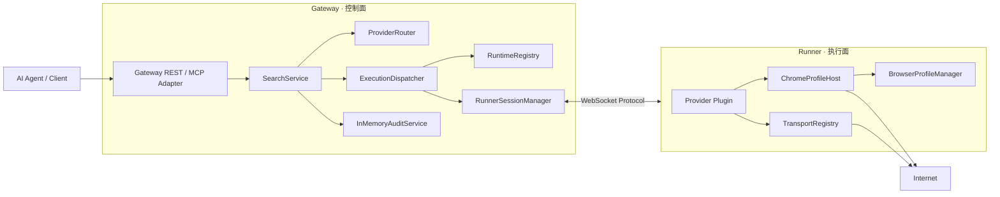

# Aylens 最终架构

> 本文只描述当前代码已经实现并作为项目基线保留的架构，不包含额外规划范围。
> 当前代码与本文不一致时，以代码为准并同步修正文档。

## 1. 项目定位

Aylens 是面向 AI Agent 的统一互联网 Retrieval Gateway。当前系统提供统一 Search 协议，并把所有真实网络访问和浏览器执行放到 Runner。

当前仓库内置 `generic-browser` 作为 Browser Provider，用于验证完整的 Gateway → Runner → Chrome → Gateway 链路。其他渠道通过相同 Provider Plugin 契约接入，不改变核心调度链路。

## 2. 最终架构边界

架构固定为两层：

- **Gateway：控制面**
- **Runner：执行面**

Gateway 不作为 Runtime，不直接访问目标网站，不启动 Chrome，也不持有代理凭据、Browser Profile 或登录态。

Runner 是唯一执行 Provider 的位置，负责真实 HTTP、代理、Chrome、Profile 和本地登录状态。



## 3. Gateway

Gateway 由 `createGatewayContext()` 组装，当前只包含：

- `ProviderRegistry`：保存 Provider Definition；
- `RuntimeRegistry`：保存已连接 Runner 的能力、容量和在线状态；
- `RunnerSessionManager`：管理 Runner WebSocket 会话和执行任务；
- `ExecutionDispatcher`：选择 Runner 并下发任务；
- `ProviderRouter`：根据 `route` / `sources` 选择 Provider；
- `SearchService`：并发执行 Provider、合并结果、生成状态；
- `InMemoryAuditService`：记录当前进程生命周期内的 Audit。

Gateway 明确不包含：

- Provider 执行实例；
- `TransportRegistry`；
- `BrowserProfileManager`；
- `ChromeProfileHost`；
- Chrome Cookie / Local Storage；
- Proxy credential。

### 3.1 Gateway Provider Definition

Gateway 只保存逻辑定义和 placement：

```yaml
providers:
  generic-browser:
    type: generic-browser
    enabled: true
    runtime:
      selector:
        os: windows
        providerType: generic-browser
        browser: chrome
        profile: browser-main
```

Provider Definition 不包含 Transport、Browser Profile 执行配置或 Provider options。

## 4. Runner

Runner 启动时创建本地 Runtime：

```text
Runner
├── Provider Plugin Loader
├── ProviderRegistry / Factories
├── Provider Deployments
├── TransportRegistry
│   ├── Direct
│   ├── HTTP Proxy
│   └── SOCKS5
├── BrowserProfileManager
└── ChromeProfileHost
```

这些资源全部属于 Runner 本机。

### 4.1 Runner Provider Deployment

Runner 使用与 Gateway 相同的 Provider ID 部署实际实现：

```yaml
browser:
  defaultProfile: browser-main

providers:
  generic-browser:
    type: generic-browser
    options:
      timeoutMs: 30000

browserProfiles:
  browser-main:
    userDataDir: "./.profiles/browser-main"
    headless: true
```

Gateway 使用 Provider ID 做路由和调度；Runner 根据同一个 Provider ID 找到本地 Deployment 并创建 Provider。

## 5. Provider Plugin

Provider 只负责渠道访问逻辑和结果映射。机器选择、Runner 调度、Audit 和全局请求编排不属于 Provider。

Provider 通过 `ProviderFactory` 在 Runner 注册。Runner 支持：

- `builtin:<implementation>`；
- `.aylens-provider` 单文件包；
- 本地 ESM 模块；
- npm package。

只有成功加载的 Provider Type 才会进入 Runner capability。

内置 `generic-browser`：

- 仅接受 HTTP / HTTPS URL；
- 拒绝 URL 中嵌入用户名密码；
- 使用 BrowserHost 打开页面；
- 提取 title 与正文文本；
- 返回统一 `SearchDocument`。

## 6. Browser Profile

`Browser Profile` 表示 Runner 上的持久浏览器工作区，不等同于某个网站。

一个 Profile 可以同时保存多个站点的 Cookie、Local Storage、IndexedDB 等状态。多个 Browser Provider 可以共享同一个 Profile。

Runner 级默认 Profile：

```yaml
browser:
  defaultProfile: browser-main
```

`generic-browser` 使用以下优先级：

```text
provider.browser.profile
        ↓ 未配置
runner.browser.defaultProfile
```

因此多个 Provider 可以默认共享 `browser-main`；需要隔离时，再为特定 Provider 显式指定其他 Profile。

`ChromeProfileHost` 按 Profile 复用 BrowserContext，`BrowserProfileManager` 通过 Lease 控制并发。默认 `maxConcurrency = 1` 时，并发占用会返回 `PROFILE_BUSY`，不会排队。

支持两种 Chrome 模式：

- `launch`：Aylens 启动 persistent Chrome context；
- `cdp`：连接外部 Chrome CDP endpoint。

## 7. Transport

Transport 只存在于 Runner，当前实现支持：

- Direct；
- HTTP / HTTPS Proxy；
- SOCKS5 / SOCKS5H。

Browser Profile 可以引用 Runner-local Transport，`ChromeProfileHost` 会把对应代理映射到浏览器启动配置。

Proxy URL 和凭据不上传 Gateway。

## 8. Runtime Registry 与调度

Runner 通过注册和心跳向 Gateway 上报：

- Runner ID、hostname、OS、version、labels；
- Provider Types；
- Provider IDs；
- Browser capability；
- Profile IDs；
- 安全的 `profileDetails`；
- `activeJobs / maxJobs`。

`RuntimeRegistry` 只选择状态为 `online` / `degraded` 且容量可用的 Runner。

selector 当前支持：

- `os`；
- `providerType`；
- `browser`；
- `profile`；
- `labels`。

未显式指定 placement 时，Dispatcher 至少要求 Runner 实际部署对应 Provider ID，并匹配 Provider Type；候选 Runner 按当前负载比例排序。

如果没有兼容 Runner，请求返回 `NO_COMPATIBLE_RUNTIME`；指定 `nodeId` 但节点离线时返回 `RUNTIME_OFFLINE`。Gateway 不做本地回退。

## 9. Runner 协议

协议版本当前为 `1`。

Runner → Gateway：

```text
REGISTER
HEARTBEAT
JOB_ACCEPTED
JOB_STARTED
JOB_RESULT
JOB_ERROR
```

Gateway → Runner：

```text
REGISTERED
EXECUTE
CANCEL
PING
```

`EXECUTE` 当前只支持 `operation = search`。任务携带 Provider ID / Type、Search input、requestId 和 traceId，不携带 Runner 本地 Provider 配置或秘密。

## 10. Search 执行流程

```text
POST /v1/search
  -> SearchService
  -> ProviderRouter
  -> 对选中的 Provider 并发执行
  -> ExecutionDispatcher
  -> RuntimeRegistry 选择 Runner
  -> RunnerSessionManager EXECUTE
  -> Runner Provider.search()
  -> JOB_RESULT / JOB_ERROR
  -> Gateway 合并 items
  -> 按 request.limit 截断
  -> completed / partial / failed
```

当前 SearchService 不做额外 Cache、Dedupe、Rank 或 Query Planner。

## 11. API

Gateway 当前提供：

```text
GET  /health
GET  /ready
POST /v1/search
GET  /v1/providers
GET  /v1/runtimes
GET  /v1/audit/:requestId
GET  /v1/admin/overview
WS   /v1/runners/connect
```

同时存在 MCP tool adapter definitions：

```text
search
list_runtimes
```

当前没有独立 MCP SDK Server / wire transport。

## 12. Admin UI

Gateway 内置 Admin UI：

```text
/admin
/admin/runtimes
/admin/providers
/admin/profiles
/admin/audits
/admin/tester
```

Admin 只展示逻辑配置和 Runner 上报的安全状态，不返回 Runner Token、Proxy credential、userDataDir、CDP endpoint、Chrome executable path、Cookie 或 Provider options 原始内容。

## 13. Audit 与状态存储

Audit 当前是内存实现：

- Gateway 重启后 Audit 不保留；
- Runtime Registry 是当前 Gateway 进程内状态；
- Browser Profile 和登录态持久化在 Runner 本地 `userDataDir`。

项目当前不依赖数据库、Redis 或对象存储。

## 14. 安全边界

固定安全边界：

- Gateway API 使用 API Key；
- Runner 使用独立 token 连接 Gateway；
- Provider 执行只发生在 Runner；
- Proxy credential 只存在 Runner；
- Cookie、Local Storage、Browser Profile 只存在 Runner；
- Admin API 对敏感字段做隐藏或脱敏；
- `generic-browser` 只接受 HTTP/HTTPS，并拒绝 URL 内嵌 credential。

## 15. 构建与部署

`pnpm build` 生成：

```text
release/
├── gateway/
│   └── aylens-gateway.mjs
├── runner/
│   └── aylens-runner.mjs
├── providers/
│   └── generic-browser.aylens-provider
├── ecosystem.config.cjs
└── pm2-start.*
```

Gateway Bundle 不包含 Provider 执行逻辑；Runner Bundle 包含内置 Provider，同时 Provider 也可以独立 `.aylens-provider` 形式分发。

## 16. 架构不变量

以下规则作为当前最终架构保持不变：

1. Gateway 永远不是抓取 Runtime。
2. Provider 永远在 Runner 执行。
3. Gateway 不接触目标网站、浏览器登录态和代理凭据。
4. Provider Definition 与 Runner Deployment 分离。
5. Runtime 调度以 Provider ID / Type 和 capability 为基础。
6. Browser Profile 是 Runner-local 持久工作区，可被多个 Browser Provider 共享。
7. 没有兼容 Runner 时明确失败，不执行本地 fallback。
8. Search、Runtime、Browser 与 Admin 的当前行为以代码和本仓库文档为唯一基线。
