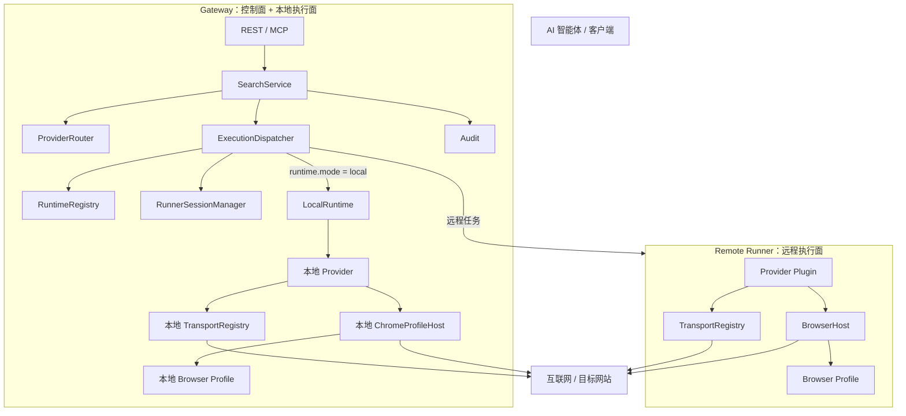
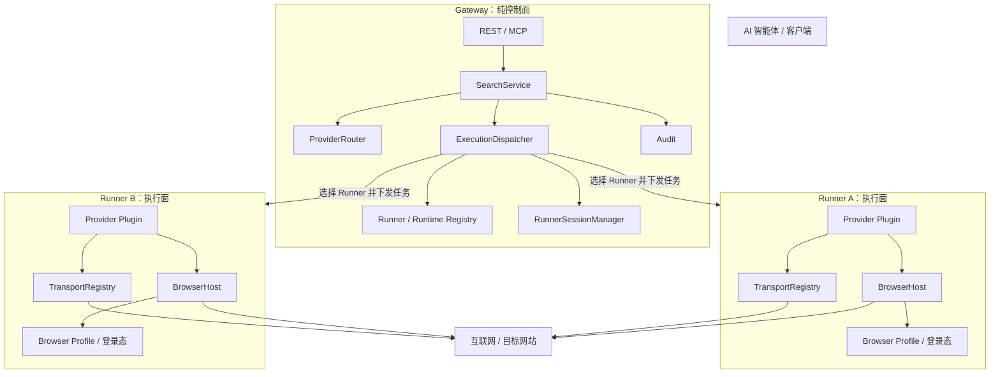
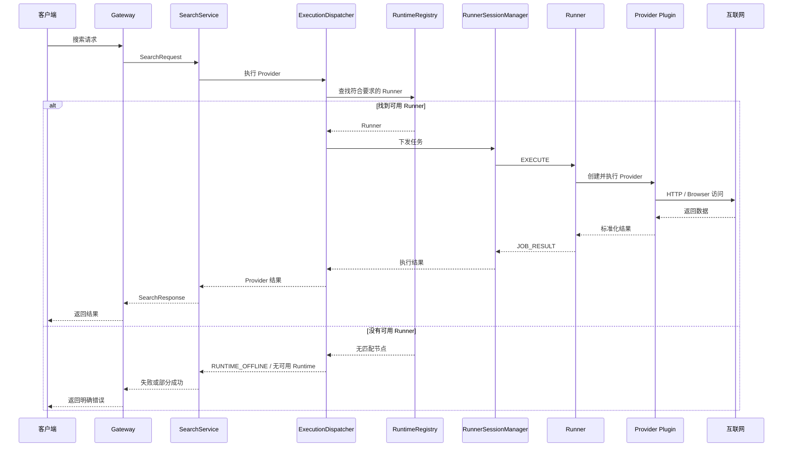
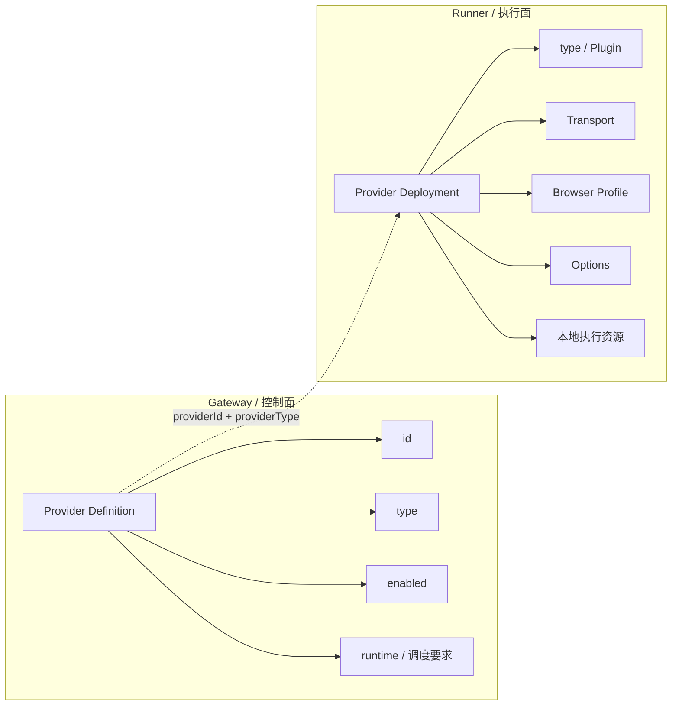
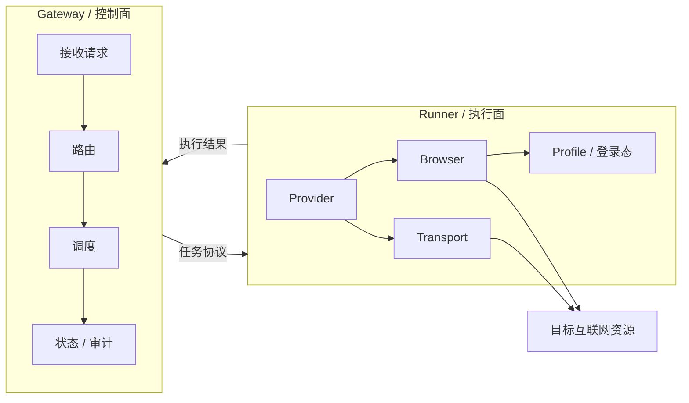

# Gateway 与 Runner 执行边界调整设计

> 状态：已落地（历史设计与迁移记录）
> 当前代码已经完成本文所述 Gateway 纯控制面 / Runner 执行面重构。文中“调整前”“目标”“迁移步骤”等章节用于保留设计背景，不应视为当前代码状态。
> 范围：仅调整 Gateway 与 Runner 的职责边界，不包含 Operation/Execution 泛化、ReadService、缓存、排序等后续架构演进。

## 1. 背景

进行本次重构前，Aylens 已经具备 Gateway、Remote Runner、Provider Plugin、Transport、BrowserHost 和 Chrome Profile 等基础能力。

当时 Gateway 同时具备两种角色：

1. **控制节点**：接收请求、路由 Provider、选择 Runtime、下发任务、汇总结果、记录审计。
2. **本地执行节点**：通过 `LocalRuntime` 在 Gateway 进程内创建 Provider，并直接使用本地 Transport、BrowserHost、Browser Profile 访问互联网。

这使 Gateway 同时承担控制面和数据抓取执行面，职责边界不够清晰。

本次调整的目标是：

> **Gateway 只负责控制与调度；所有真实的数据抓取、网络访问、浏览器访问和登录态使用都必须发生在 Runner。**

---

## 2. 调整前架构（历史）



### 2.1 当前代码中的具体表现

当前 Gateway 启动时会：

- 注册一个 `LOCAL_RUNTIME_ID`；
- 创建 `TransportRegistry`；
- 创建 `BrowserProfileManager`；
- 创建 `ChromeProfileHost`；
- 创建 `LocalRuntime`；
- 将 `LocalRuntime` 注入 `ExecutionDispatcher`。

同时 Provider 配置允许：

```yaml
runtime:
  mode: local
```

并且当前该配置还是 Provider Runtime 的默认值。

当 Dispatcher 遇到 `runtime.mode = local` 时，会直接执行：

```text
Gateway
  -> LocalRuntime
  -> Provider
  -> Transport / Browser
  -> Internet
```

因此 Gateway 当前确实属于数据抓取执行节点。

---

## 3. 目标架构

调整后，Gateway 不再是 Runtime。



核心规则：

> **没有可用 Runner，就不能执行抓取任务。Gateway 不提供本地执行兜底。**

---

## 4. 职责边界

### 4.1 Gateway 应负责

Gateway 保留：

- REST / MCP / Admin 接入；
- 请求认证；
- SearchService 等业务编排；
- Provider 配置与逻辑路由；
- Runner 注册和在线状态；
- Runner 能力发现；
- Runtime 选择与任务调度；
- Runner Session / WebSocket 管理；
- 任务超时和结果接收；
- Audit；
- Admin UI。

Gateway 可以知道：

- Provider 的逻辑定义；
- Provider Type；
- Provider 需要什么运行能力；
- 哪些 Runner 宣告拥有这些能力。

但 Gateway **不实际创建并运行抓取 Provider**。

### 4.2 Runner 应负责

Runner 独占：

- Provider Plugin 加载与实例化；
- Provider 实际执行；
- HTTP 请求；
- Direct / HTTP Proxy / SOCKS5；
- BrowserHost；
- Playwright / Chrome；
- Browser Profile；
- Cookie / Local Storage / 登录态；
- Profile Lease；
- Runtime 本地代理凭据；
- 与目标网站发生的真实网络通信。

原则：

> 与“如何访问目标网站”有关的实现和敏感状态，都属于 Runner。

Provider 实现源码与部署选择是两个维度：Aylens 官方实现统一维护在 `src/providers/<implementation>/`。正式构建时内置实现进入 Runner Bundle，不进入 Gateway Bundle；需要独立分发时则打成 `.aylens-provider` 单文件包。是否加载某个实现仍由每台 Runner 自己的 `plugins.modules` 决定。第三方实现也可使用 `.aylens-provider`、本地 ESM 或 npm package，并走同一套 Plugin 契约与校验流程。

---

## 5. Gateway 应移除的能力

### 5.1 移除 LocalRuntime

删除 Gateway 中的：

```text
src/runtime/local-runtime.ts
```

`ExecutionDispatcher` 不再依赖 `LocalRuntime`。

### 5.2 Gateway 不再注册为 Runtime

删除 Gateway Context 中：

```text
LOCAL_RUNTIME_ID
hostname / os
labels.role = gateway
capacity.maxJobs
本地 runtime capabilities
```

`RuntimeRegistry` 中只保存真正连接到 Gateway 的 Runner。

### 5.3 Gateway 不再创建抓取 Transport

Gateway Context 不再创建用于 Provider 抓取的：

```text
DirectTransportFactory
HttpProxyTransportFactory
Socks5TransportFactory
TransportRegistry
```

这些组件应由 Runner Runtime 创建和持有。

注意：如果未来 Gateway 自身存在普通基础设施 HTTP 客户端，例如调用数据库、Webhook 或控制 API，应使用独立基础设施客户端，不能重新复用“Provider Transport”概念。

### 5.4 Gateway 不再创建 Browser Runtime

Gateway Context 删除：

```text
BrowserProfileManager
ChromeProfileHost
browserProfiles
browser
```

Chrome、Playwright、Profile 和登录态只存在于 Runner。

### 5.5 Gateway 不再加载执行型 Provider Factory

Gateway 的 ProviderRegistry 应逐步收敛为：

```text
Provider Definition / Provider Catalog
```

Gateway 需要知道 Provider：

- id；
- type；
- enabled；
- runtime requirements；
- routing information；
- 非敏感调度配置。

真正的 `ProviderFactory.create()` 只发生在 Runner。

本次调整可以先保留现有 ProviderRegistry 数据结构，避免一次性扩大重构范围，但 Gateway 不再调用 `createLocal()`。

---

## 6. Runtime 配置调整

### 6.1 删除 local 模式

当前：

```yaml
providers:
  example:
    type: generic-browser
    runtime:
      mode: local
```

目标：

```yaml
providers:
  example:
    type: generic-browser
    runtime:
      nodeId: windows-runner-01
```

或者：

```yaml
providers:
  example:
    type: generic-browser
    runtime:
      selector:
        os: windows
        providerType: generic-browser
        profile: main-browser
```

Provider Runtime Schema 从：

```text
local | nodeId | selector
```

调整为：

```text
nodeId | selector
```

不保留隐式 local fallback。

### 6.2 默认行为

不建议再给 Provider 默认：

```text
runtime.mode = local
```

建议 Provider 必须显式声明 Runtime 选择方式。

如果未来希望支持“任意满足 Provider Type 的 Runner”，可以单独设计明确的自动调度语义，而不是用 Gateway 本地执行作为默认值。

---

## 7. 调整后的执行链



整个执行链中 Gateway 不再访问目标互联网资源。

---

## 8. 配置归属

调整后建议明确区分 Gateway 配置与 Runner 配置。

### Gateway 配置

保留：

```text
server
auth
runnerTokens
runtimeRegistry
providers
routes
```

其中 Provider 配置主要描述逻辑 Provider 和调度要求。

### Runner 配置

负责：

```text
runner identity
provider plugins
transports
proxy credentials
browser profiles
chrome executable
CDP endpoint
profile directories
local secrets
capacity
```

最终原则：

```text
Gateway 配置：我要执行什么、应该在哪里执行
Runner 配置：我能执行什么、具体怎么访问互联网
```

---

## 8.1 Provider Definition 与 Provider Deployment

Provider 配置进一步拆成两个所有权明确的模型。



Gateway 的 Provider Definition 不再保存或下发 `transport`、`browser.profile`、`options` 等执行配置。Runner 使用相同的 `providerId` 查找本地 Provider Deployment。

任务协议只传递 `providerId`、`providerType`、`operation`、`input`、`requestId` 和 `traceId`，不再包含完整 `providerConfig`。

Runner 收到任务后根据 `providerId` 查找本地 Deployment，校验类型一致后，使用 Runner 本地的 Transport、Browser Profile 和 Options 创建 Provider。

```text
Gateway Provider Definition = 做什么 + 路由到哪里
Runner Provider Deployment = 在本机具体怎么做
```

---

## 9. Admin UI 的影响

Admin UI 中不应再展示一个名为 `local` 的 Gateway Runtime。

Runtime 页面只展示 Runner：

```text
Runner ID
状态
OS
Provider Types
Browser 能力
Profiles
容量
活动任务
最后心跳
```

Provider 页面可以继续展示 Provider 的 Runtime 绑定，例如：

```text
generic-browser-main
  Provider Type: generic-browser
  Runtime: selector(profile=main-browser)
```

如果没有任何 Runner 满足条件，应明确显示：

```text
无可用执行节点
```

而不是回退到 Gateway。

---

## 10. 建议迁移顺序

为了减少一次性修改风险，建议按以下顺序实施。

### 第一步：禁止新的本地执行

- 修改配置 Schema，删除 `runtime.mode = local`；
- Provider 不再默认 local；
- Dispatcher 删除 local 分支；
- 测试改为必须通过 Runner 执行。

完成后，系统行为已经满足“所有抓取必须经过 Runner”。

### 第二步：清理 Gateway 执行能力

从 Gateway Context 移除：

- LocalRuntime；
- TransportRegistry；
- BrowserProfileManager；
- ChromeProfileHost；
- Provider Factory 本地执行依赖。

删除不再使用的 LocalRuntime。

### 第三步：收紧 Provider 边界

确认：

- Gateway 只维护 Provider Definition；
- Runner 根据 Provider Type 加载 Provider Plugin；
- Gateway 不实例化执行型 Provider。

### 第四步：调整管理界面和文档

- Runtime 页面移除 local Gateway；
- Provider 页面更新 Runtime 展示；
- README 更新启动方式；
- API / Runtime / Provider 文档同步修改。

---

## 11. 不在本次范围内

为了保持调整可控，本次暂不处理：

- Search / Read 统一 Operation 模型；
- ExecutionDispatcher 泛化；
- Provider Capability 新模型；
- Runner 内部大规模拆分；
- Cache；
- Retry / Fallback；
- Normalize / Dedupe / Rank；
- 数据库持久化；
- 完整 MCP Server。

这些可以在 Gateway / Runner 边界稳定后继续设计。

---

## 12. 验收标准

完成本次重构后，应满足：

1. Gateway 进程不存在 `LocalRuntime`。
2. Gateway 不注册为 Runtime。
3. Provider 配置不存在 `runtime.mode = local`。
4. Gateway 不创建 Provider 抓取用 Transport。
5. Gateway 不启动 Chrome / Playwright。
6. Gateway 不读取或持有 Chrome Profile 登录态。
7. Gateway 不实例化执行型 Provider Plugin。
8. 所有 Provider 执行都必须通过已连接 Runner。
9. 没有 Runner 时，请求返回明确的“无可用执行节点”错误，不做本地回退。
10. Runner 断开后，对应 Runtime 被标记离线，Gateway 不接管其任务执行。
11. `generic-browser` 完整链路只能通过 Runner 验证成功。
12. Gateway 单独启动时仍可提供管理、健康检查和 API，但不能执行真实抓取。
13. Gateway Provider Definition 不包含 Transport、Browser Profile 或 Provider Options。
14. EXECUTE 协议不携带完整 ProviderConfig。
15. Runner 必须根据 providerId 使用本地 Provider Deployment 执行任务。

---

## 13. 调整后的核心边界



最终边界可以概括为一句话：

> **Gateway 决定“做什么、交给谁做”；Runner 决定“具体怎么做”，并且只有 Runner 可以接触目标网站、代理、浏览器和登录态。**
